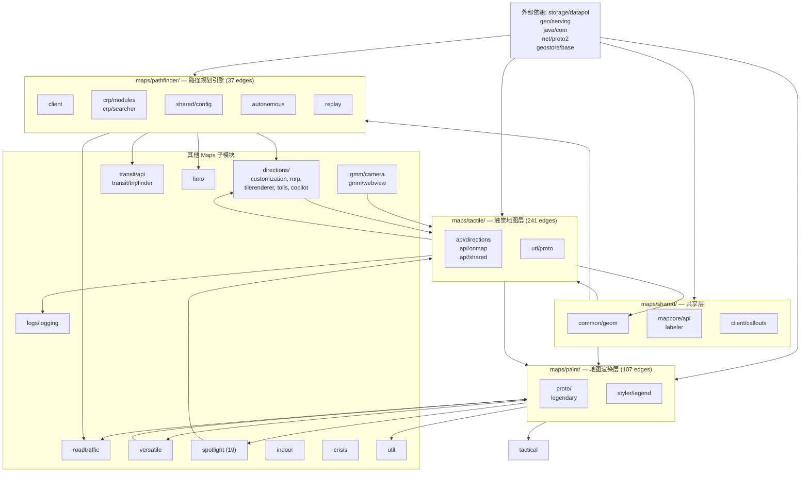
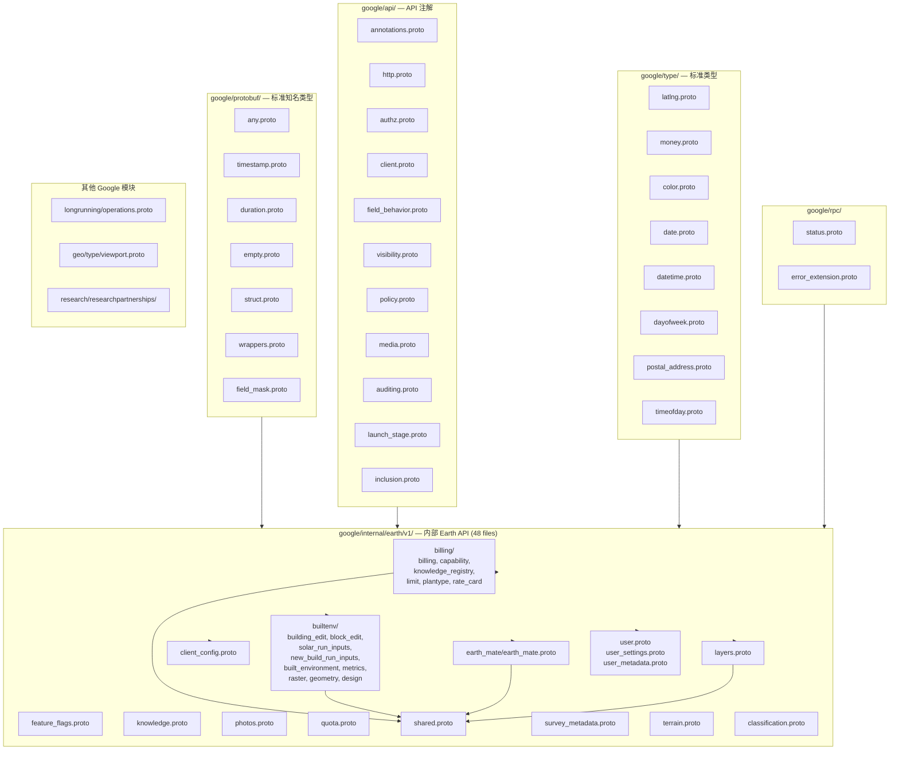
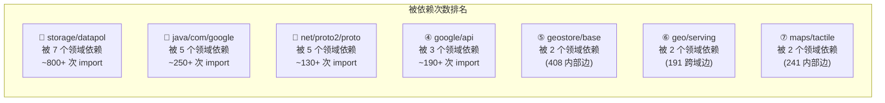

# Earth Studio WASM — Proto 依赖关系图纸

> 基于 1,316 个 `.proto` 文件中 **4,195 条 import 关系** 的完整依赖图谱

---

## 一、顶层领域间依赖关系（38 个领域全景图）

```mermaid
flowchart TD
    %% 外部基础层（被几乎所有模块依赖）
    storage["storage/datapol<br/>(9 files)"]
    google_proto["google/protobuf<br/>(7 files)"]
    google_api["google/api<br/>(11 files)"]
    google_type["google/type<br/>(8 files)"]
    java["java/com<br/>(20 files)"]
    net["net/proto2<br/>(7 files)"]
    devtools["devtools/staticanalysis<br/>(1 file)"]
    third_party["third_party<br/>(5 files)"]
    privacy["privacy/pattributes<br/>(8 files)"]
    i18n["i18n/localization<br/>(1 file)"]
    wireless["wireless/android<br/>(3 files)"]

    %% 核心 Geo 层
    subgraph GEO["geo/ 领域 (411 files)"]
        direction TB
        geo_serving["geo/serving (101)"]
        geo_photo["geo/photo (111)"]
        geo_earth["geo/earth (122)"]
        geo_imagery["geo/imagery (27)"]
        geo_content["geo/contentflows"]
        geo_moderation["geo/moderation"]
        geo_search["geo/search"]
        geo_ar["geo/ar"]
        geo_case["geo/case"]
        geo_render["geo/render"]
        geo_tasking["geo/tasking"]
    end

    %% 核心 Maps 层
    subgraph MAPS["maps/ 领域 (344 files)"]
        direction TB
        maps_tactile["maps/tactile (241)"]
        maps_paint["maps/paint (107)"]
        maps_spotlight["maps/spotlight (19)"]
        maps_pathfinder["maps/pathfinder (37)"]
        maps_roadtraffic["maps/roadtraffic"]
        maps_transit["maps/transit (9)"]
        maps_limo["maps/limo"]
        maps_versatile["maps/versatile (16)"]
        maps_shared["maps/shared (16)"]
        maps_gmm["maps/gmm"]
        maps_logs["maps/logs (25)"]
        maps_directions["maps/directions"]
    end

    %% 日志层
    subgraph LOGS["logs/ 领域 (181 files)"]
        logs_proto["logs/proto (223)"]
        logs_maps["logs/maps (17)"]
    end

    %% 存储层
    subgraph GEOSTORE["geostore/ 领域 (162 files)"]
        geostore_base["geostore/base (408)"]
    end

    %% Google 内部 API
    google_internal["google/internal<br/>(48 files)"]

    %% GWS
    gws["gws/mothership<br/>(15 files)"]

    %% Knowledge
    knowledge["knowledge/graph<br/>(11 files)"]

    %% === 依赖关系箭头 ===

    %% 外部基础层 -> 核心层
    storage --> GEO
    storage --> MAPS
    storage --> LOGS
    storage --> GEOSTORE
    storage --> google_internal
    storage --> gws
    storage --> knowledge

    java --> GEO
    java --> MAPS
    java --> LOGS
    java --> GEOSTORE

    net --> MAPS
    net --> GEOSTORE
    net --> GEO
    net --> google_internal

    devtools --> GEO

    google_api --> GEOSTORE
    google_api --> google_internal
    google_api --> LOGS

    google_proto --> GEO
    google_proto --> LOGS
    google_proto --> google_internal

    google_type --> GEO

    privacy --> MAPS
    privacy --> LOGS

    wireless --> google_internal

    i18n --> GEO

    third_party --> MAPS
    third_party --> GEO

    %% GEO 内部
    geo_serving --> geo_photo
    geo_serving --> MAPS
    geo_earth --> geo_photo
    geo_earth --> geo_imagery
    geo_earth --> geo_content
    geo_content --> geo_photo
    geo_content --> geo_moderation
    geo_search --> geo_serving
    geo_case --> geo_serving
    geo_case --> geo_photo
    geo_imagery --> geo_ar
    geo_imagery --> geo_render
    geo_imagery --> geo_tasking
    geo_imagery --> geo_content
    geo_render --> geo_imagery

    %% GEO -> 外部
    GEO --> google_internal
    GEO --> logs_proto
    GEO --> geostore_base

    %% MAPS 内部
    maps_tactile --> maps_paint
    maps_tactile --> maps_shared
    maps_tactile --> maps_logs
    maps_paint --> maps_spotlight
    maps_paint --> maps_shared
    maps_paint --> maps_versatile
    maps_paint --> maps_roadtraffic
    maps_spotlight --> maps_tactile
    maps_pathfinder --> maps_roadtraffic
    maps_pathfinder --> maps_transit
    maps_pathfinder --> maps_limo
    maps_pathfinder --> maps_directions
    maps_gmm --> maps_tactile
    maps_directions --> maps_tactile
    maps_versatile --> maps_paint
    maps_shared --> maps_paint

    %% MAPS -> 外部
    MAPS --> geo_serving
    MAPS --> logs_proto
    MAPS --> geostore_base
    MAPS --> third_party
    MAPS --> privacy

    %% LOGS 内部
    logs_proto --> logs_maps
    logs_proto --> maps_tactile
    logs_proto --> maps_pathfinder
    logs_proto --> maps_directions
    LOGS --> java
    LOGS --> google_api
    LOGS --> google_proto
    LOGS --> privacy

    %% GEOSTORE 内部
    GEOSTORE --> google_api
    GEOSTORE --> net
    GEOSTORE --> storage
    GEOSTORE --> knowledge
    GEOSTORE --> java

    %% Google Internal
    google_internal --> geo_earth
    google_internal --> google_api
    google_internal --> google_proto
    google_internal --> net
    google_internal --> wireless
    google_internal --> storage

    %% GWS
    gws --> storage

    %% Knowledge
    knowledge --> storage
```



| 图例 | 含义 |
|---|---|
| 箭头 → | "依赖于" — 箭头指向被导入的模块 |
| 括号内数字 | 该层级内的 import 次数 |
| 虚线框 | 顶层领域分组 |

---

## 二、geo/earth 核心内部依赖图（Earth Studio 主应用）

```mermaid
flowchart TD
    %% 基础层 proto
    earth_proto_commands["geo/earth/proto/commands.proto"]
    earth_proto_geometry["geo/earth/proto/geometry.proto"]
    earth_proto_mapstyle["geo/earth/proto/mapstyle.proto"]
    earth_proto_photos["geo/earth/proto/photos.proto"]
    earth_proto_error["geo/earth/proto/error_response.proto"]
    earth_proto_content["geo/earth/proto/contentcreation/content_editing_model.proto"]
    earth_proto_renderable["geo/earth/proto/renderable-entity.proto"]
    earth_proto_storage["geo/earth/proto/storage_restrictions.proto"]
    earth_proto_config["geo/earth/proto/compile_time_config.proto"]
    earth_proto_earthmate["geo/earth/proto/earth_mate/overhead_imagery.proto"]

    %% 外部依赖
    ext_commands["外部: google/protobuf<br/>storage/datapol<br/>net/proto2"]
    ext_content["外部: geo/earth/proto/*<br/>google/type<br/>google/protobuf"]

    %% 应用核心层
    subgraph core["cpp/core/ — 应用核心层"]
        direction TB
        document["document/<br/>capability, import, metadata,<br/>icon, role, ioadapters"]
        design["design/<br/>designexport"]
        designinput["designinput/<br/>designvalidation, validinputs"]
        deeplink["deeplink/<br/>legacydatastate"]
        experiments["experiments/<br/>experiment_flags"]
        account["account/<br/>authinfo"]
        kmltree["kmltree"]
        layers["layers"]
        styleeditor["styleeditor"]
        info["info"]
        localfs["localfilesystem"]
        earthmate["earthmate/<br/>debug_options"]
        protos_core["protos"]
    end

    %% Studio Presenters 层
    subgraph presenters["cpp/presenters/ — 展示层"]
        direction TB
        pres_designdetails["designdetails"]
        pres_designviewer["designviewer"]
        pres_propertyeditor["propertyeditor"]
        pres_solar["solardesigninput"]
    end

    subgraph studio["cpp/studio_presenters/ — Studio 展示层"]
        direction TB
        stu_baselayer["baselayer"]
        stu_camera["camera"]
        stu_property["propertyeditor"]
        stu_settings["settings"]
        stu_viewstatus["viewstatus"]
    end

    %% 状态层（60+ state slices）
    subgraph state["cpp/core/state/ — 应用状态层 (60+)"]
        direction TB
        st_search["search"]
        st_document["document"]
        st_designmgr["designmanager"]
        st_earthmate["earthmate"]
        st_layers["layers"]
        st_streetview["streetview"]
        st_timemachine["timemachine"]
        st_timelapse["timelapse"]
        st_measure["measuretool"]
        st_drawing["drawingtool"]
        st_propedit["propertyeditor"]
        st_onboarding["onboarding"]
        st_solar["solardesigninput"]
        st_newbuild["newbuilddesigninput"]
        st_buildingedit["buildingeditor"]
        st_homescreen["homescreen"]
        st_card["card"]
        st_featurecat["featurecategoryflags"]
        st_others["... (40+ more slices)"]
    end

    %% 依赖关系
    ext_commands --> earth_proto_commands
    ext_content --> earth_proto_content

    earth_proto_commands --> core
    earth_proto_content --> core
    earth_proto_geometry --> core
    earth_proto_mapstyle --> core
    earth_proto_photos --> core
    earth_proto_error --> core
    earth_proto_storage --> core
    earth_proto_config --> core
    earth_proto_earthmate --> core
    earth_proto_renderable --> core

    core --> presenters
    core --> studio
    core --> state

    presenters --> state
    studio --> state

    document --> design
    document --> deeplink
    design --> designinput

    state --> core
```



---

## 三、maps/ 内部依赖图（Google Maps 生态系统）



---

## 四、logs/ 与 geostore/ 内部依赖图

```mermaid
flowchart TD
    %% 外部基础
    ext_logs["外部: storage/datapol<br/>google/protobuf<br/>google/api<br/>java/com<br/>privacy/pattributes"]

    %% Logs 主结构
    subgraph logs["logs/ 领域 (181 files)"]
        direction TB
        
        subgraph logs_proto["logs/proto/ — 主日志层 (223 内部边)"]
            direction TB
            lp_earth["geo/earth/app/<br/>earth_log.proto<br/>★ 89 event types"]
            lp_maps_tactile["maps/tactile/"]
            lp_maps_dir["maps/directions/mrp/"]
            lp_maps_transit["maps/transit/"]
            lp_maps_pf["maps/pathfinder/"]
            lp_maps_rt["maps/roadtraffic/"]
            lp_maps_limo["maps/limo/"]
            lp_maps_geo["maps/geoevents/"]
            lp_visual["visual_element/"]
            lp_hotels["hotels/"]
            lp_ads["ads/travel/"]
            lp_transport["geo/transportation/"]
            lp_ar["geo/ar/"]
            lp_annotations["logs_annotations/"]
        end

        subgraph logs_maps["logs/maps/ — Maps 日志 (17 边)"]
            direction TB
            lm_featureid["featureid.proto"]
            lm_mobile["maps/mobile/"]
        end
    end

    %% Geostore 主结构
    subgraph geostore["geostore/ 领域 (162 files)"]
        direction TB

        subgraph gs_base["geostore/base/proto/ — 核心类型层 (408 内部边)"]
            direction TB
            gs_featureid["featureid.proto<br/>★ S2 cell 标识"]
            gs_address["address.proto<br/>addresscomponent.proto"]
            gs_polyline["polyline.proto<br/>segmentpath.proto"]
            gs_route["route.proto<br/>routedirection.proto"]
            gs_intersection["intersection.proto"]
            gs_elevation["elevation.proto<br/>elevationmodel.proto"]
            gs_restriction["restriction.proto"]
            gs_speedlimit["speed_limit.proto"]
            gs_parking["parking.proto"]
            gs_openinghours["openinghours.proto"]
            gs_price["priceinfo.proto<br/>durationbasedrate.proto"]
            gs_traffic["traffic_flow_adjustment.proto"]
            gs_transit["transit_line_variant.proto"]
            gs_track["track.proto"]
            gs_sign["sign.proto"]
            gs_level["level.proto"]
            gs_cityjson["cityjson.proto"]
            gs_doodle["doodle.proto"]
            gs_autonomous["autonomous_driving.proto"]
            gs_source["sourceinfo.proto<br/>sourceinfolist.proto"]
            gs_display["display_data.proto"]
            gs_median["median.proto"]
            gs_vehicle["vehicle_occupancy_range.proto"]
            gs_url["url.proto"]
            gs_stable["stable_id_options.proto"]
            gs_version["version_token_options.proto"]
        end

        subgraph gs_other["其他 geostore 子模块"]
            direction TB
            gs_edit["edit/"]
            gs_matching["matching/"]
            gs_ontology["ontology/"]
            gs_client["client/attachments"]
            gs_tools["tools/"]
        end
    end

    %% 依赖
    ext_logs --> logs
    ext_logs --> geostore

    lp_earth --> lp_visual
    lp_earth --> lp_transport
    lp_earth --> lp_ar
    lp_earth --> lp_annotations
    lp_visual --> lp_maps_tactile
    lp_visual --> lp_maps_dir
    lp_visual --> lp_hotels
    lp_visual --> lp_ads

    logs_proto --> logs_maps

    gs_base --> gs_edit
    gs_base --> gs_matching
    gs_base --> gs_ontology
    gs_base --> gs_client
    gs_base --> gs_tools

    gs_edit --> gs_matching
```



---

## 五、google/ 内部依赖图



---

## 六、完整拓扑排序（依赖层序）

基于 4,195 条 import 边分析，依赖从底层到高层的层级关系：

```
第 0 层（零依赖 — 纯基础类型）:
  ├── google/protobuf/*        (7 files)
  ├── google/type/*            (8 files)
  ├── google/rpc/*             (2 files)
  ├── google/geo/type/*        (1 file)
  ├── google/longrunning/*     (1 file)
  └── net/proto2/proto/*       (核心描述符)

第 1 层（只依赖第 0 层）:
  ├── google/api/*             (11 files)
  ├── storage/datapol/*        (9 files)
  ├── i18n/localization/*      (1 file)
  ├── privacy/pattributes/*    (8 files)
  ├── wireless/android/*       (3 files)
  └── java/com/*               (20 files)

第 2 层（只依赖 0-1 层）:
  ├── geostore/base/proto/*    (核心地物类型, 408 内部边)
  ├── knowledge/graph/*        (11 files)
  └── third_party/*            (5 files)

第 3 层（依赖 0-2 层）:
  ├── geo/photo/proto/*        (111 内部边)
  ├── geo/serving/proto/*      (90 内部边)
  ├── geo/imagery/*            (27 边)
  ├── geo/contentflows/*       (1 边)
  ├── maps/shared/*            (16 边)
  ├── maps/paint/proto/*       (87 内部边)
  └── devtools/staticanalysis/* (1 file)

第 4 层（依赖 0-3 层）:
  ├── geo/earth/proto/*        (核心 Earth 类型, 33 内部边)
  ├── maps/tactile/*           (241 边 — 最大子模块)
  ├── maps/spotlight/*         (19 边)
  ├── maps/roadtraffic/*
  ├── maps/transit/*
  ├── maps/limo/*
  └── maps/versatile/*         (13 内部边)

第 5 层（依赖 0-4 层）:
  ├── geo/earth/app/cpp/core/* (应用核心, 53 内部边)
  ├── maps/pathfinder/*        (37 边)
  ├── maps/directions/*
  ├── maps/gmm/*
  └── google/internal/earth/*  (48 files)

第 6 层（依赖 0-5 层）:
  ├── geo/earth/app/cpp/state/* (60+ 状态切片)
  ├── geo/earth/app/cpp/presenters/*
  ├── geo/earth/app/cpp/studio_presenters/*
  ├── gws/mothership/*         (15 files)
  └── maps/logs/*

第 7 层（最顶层 — 仅被依赖，不依赖上层）:
  └── logs/proto/*             (223 内部边, 181 files total)
```

---

## 七、核心依赖热力图（Top 被依赖模块）



---

## 备注

- 箭头方向：**A → B** 表示 A 导入了 B（A 依赖 B）
- 括号内数字表示统计到的 import 边数量（同层内或跨层）
- 零依赖模块（第 0 层）是整个系统的基石，修改需极度谨慎
- `logs/proto/` 位于最高层，几乎依赖所有其他模块，用于全面事件捕获
- `geo/earth/app/cpp/state/` 的 60+ 状态切片之间存在复杂的相互依赖，未在图中完全展开
