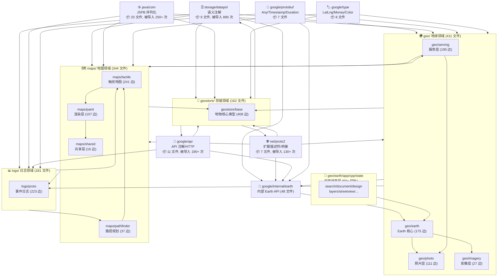
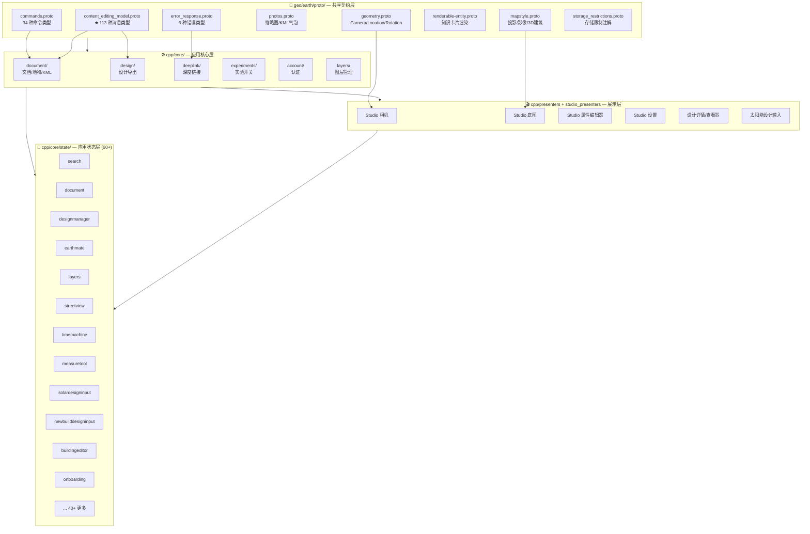
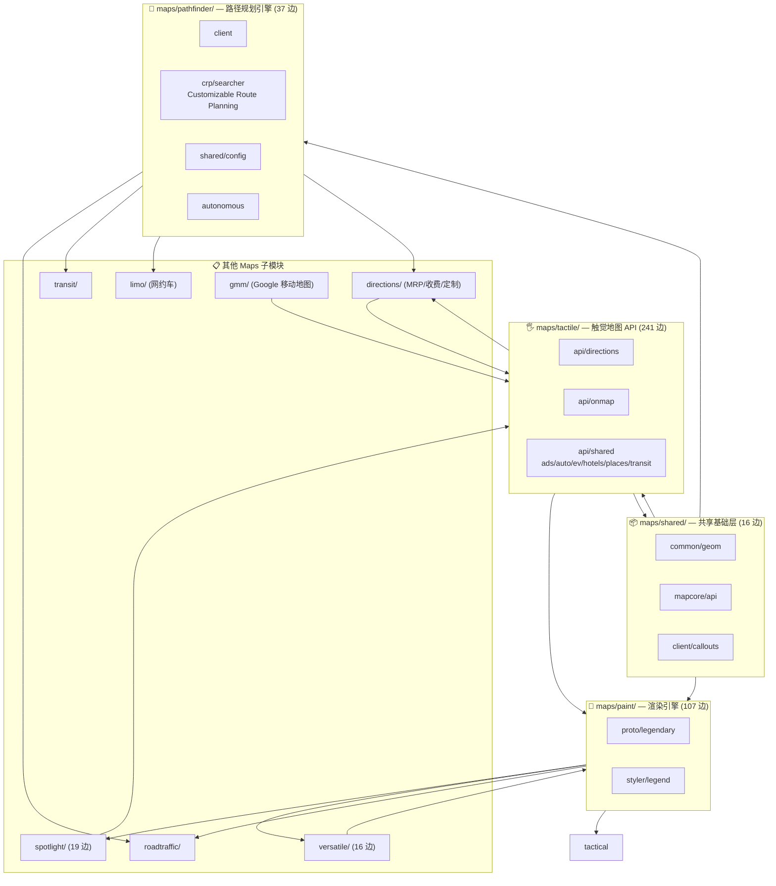
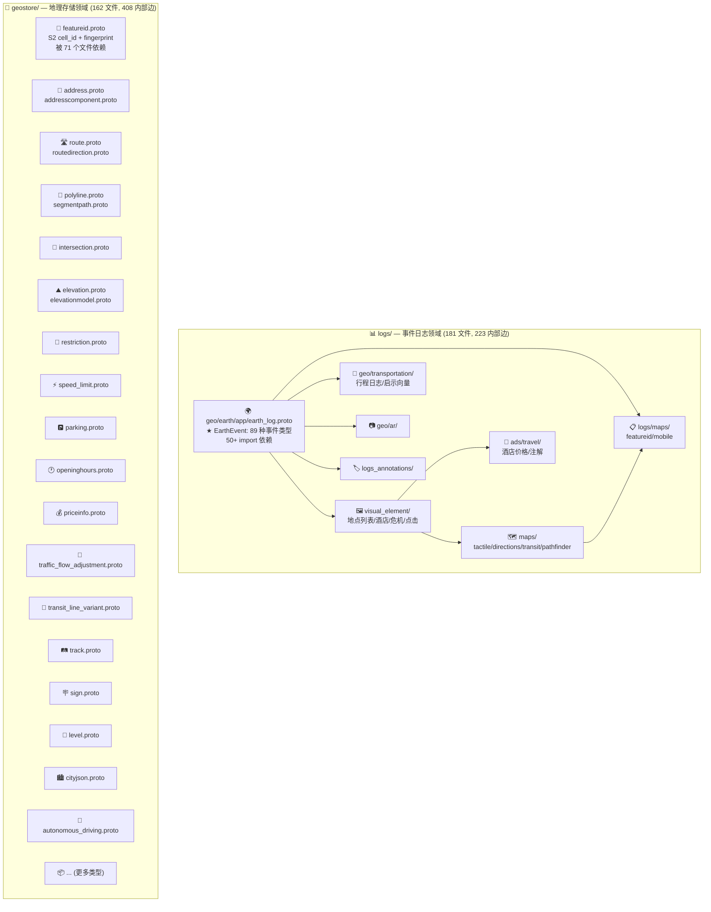
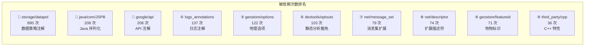

# Earth Studio WASM — Proto 依赖关系图纸（中文版）

> 基于 **1,316 个 `.proto` 文件**中 **4,195 条 import 关系**的完整依赖图谱分析

---

## 一、顶层领域间依赖关系全景图



> 图例：箭头 **A → B** 表示 A 导入了 B（即 A 依赖于 B）。数字表示统计到的 import 边数量。

---

## 二、geo/earth 核心内部依赖图（Earth Studio 主应用）



---

## 三、maps/ 内部依赖图（Google Maps 生态系统）



---

## 四、logs/ 与 geostore/ 内部依赖图



---

## 五、完整依赖拓扑层级（从底层到顶层）

```
第 0 层（零依赖 — 系统基石）:
  ├── google/protobuf/*        (7 文件)
  ├── google/type/*            (8 文件)
  ├── google/rpc/*             (2 文件)
  ├── google/geo/type/*        (1 文件)
  ├── google/longrunning/*     (1 文件)
  └── net/proto2/proto/*       (核心描述符)
       ▲ 修改需极度谨慎！影响全局

第 1 层（仅依赖第 0 层）:
  ├── google/api/*             (11 文件)
  ├── storage/datapol/*        (9 文件)  ← 被依赖最多 (890 次!)
  ├── i18n/localization/*      (1 文件)
  ├── privacy/pattributes/*    (8 文件)
  ├── wireless/android/*       (3 文件)
  └── java/com/*               (20 文件)

第 2 层（依赖 0-1 层）:
  ├── geostore/base/proto/*    (核心地物类型, 408 内部边)
  ├── knowledge/graph/*        (11 文件)
  └── third_party/*            (5 文件)

第 3 层（依赖 0-2 层）:
  ├── geo/photo/proto/*        (111 内部边)
  ├── geo/serving/proto/*      (90 内部边, 195 跨域边)
  ├── geo/imagery/*            (27 边)
  ├── geo/contentflows/*
  ├── maps/shared/*            (16 边)
  ├── maps/paint/proto/*       (87 内部边)
  └── devtools/staticanalysis/*

第 4 层（依赖 0-3 层）:
  ├── geo/earth/proto/*        (核心 Earth 类型)
  ├── maps/tactile/*           (241 边 — 最大子模块!)
  ├── maps/spotlight/*         (19 边)
  ├── maps/roadtraffic/*
  ├── maps/transit/*
  ├── maps/limo/*
  └── maps/versatile/*

第 5 层（依赖 0-4 层）:
  ├── geo/earth/app/cpp/core/* (应用核心)
  ├── maps/pathfinder/*        (37 边)
  ├── maps/directions/*
  ├── maps/gmm/*
  └── google/internal/earth/*  (48 文件)

第 6 层（依赖 0-5 层）:
  ├── geo/earth/app/cpp/state/* (60+ 状态切片)
  ├── geo/earth/app/cpp/presenters/*
  ├── geo/earth/app/cpp/studio_presenters/*
  ├── gws/mothership/*         (15 文件)
  └── maps/logs/*

第 7 层（最顶层 — 消费者，不被下层依赖）:
  └── logs/proto/*             (223 内部边, 181 文件)
       ▲ 依赖所有下层模块，用于全面事件捕获
```

---

## 六、核心被依赖热力图（Top 10）



---

## 七、数据统计总览

| 统计项 | 数值 | 说明 |
|---|---|---|
| 总 proto 文件数 | **1,316** | |
| 总 import 边数 | **4,195** | |
| 平均单文件 import 数 | **~3.2** | |
| 零 import 文件（叶子节点） | **~150+** | 纯枚举/基础消息 |
| 最广泛被依赖 | `storage/datapol/...semantic_annotations.proto` | 890 次 |
| 最大内部依赖子图 | `geostore/base/proto/` | 408 条内部边 |
| 第二大内部依赖子图 | `maps/tactile/api/` | 241 条内部边 |
| 第三大内部依赖子图 | `logs/proto/` | 223 条内部边 |
| Import 最多的文件 | `logs/proto/geo/earth/app/earth_log.proto` | 50+ 个 import |
| 跨域边最多的模块 | `geo/serving` → 外部 | 195 条跨域边 |
| 最大状态树 | `geo/earth/app/cpp/state/` | 60+ 状态切片 |

---

## 八、快速查询命令

```bash
# 1. 提取全部 import 关系
grep -rn "^import" --include="*.proto" . > all_imports.txt

# 2. 查找谁依赖了某个文件（反向依赖）
grep "-> path/to/target.proto$" all_imports.txt

# 3. 查找某个文件依赖了谁（正向依赖）
grep "^path/to/source.proto ->" all_imports.txt

# 4. 统计某领域的被依赖次数
awk -F' -> ' '$2 ~ /^geo\/earth\/proto\//' all_imports.txt | wc -l

# 5. 找到循环依赖（如果存在）
# （当前分析未发现循环依赖 — 拓扑层级结构良好）
```

---

*数据来源：对 1,316 个 .proto 文件中 4,195 条 import 语句的完整静态分析*
*生成时间：2026-08-12*
