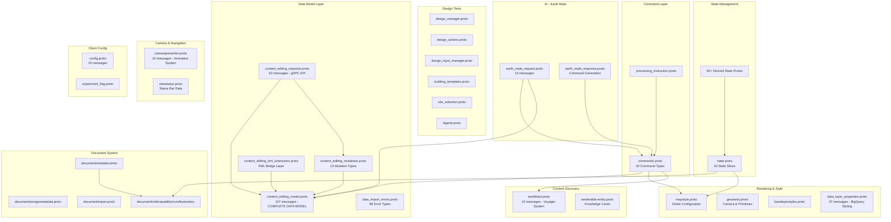

# Google Earth Studio — Complete Proto Architecture Analysis

> Auto-generated analysis of ALL 159 `.proto` files under `geo/earth/`
> Generated: 2026-08-12

---

## System Architecture Overview

Google Earth Studio's proto layer defines the complete data model, state management, command system, and rendering pipeline for Google Earth. The architecture follows these major domains:

| Domain | Directory | Purpose |
|--------|-----------|---------|
| **Core Protocol** | `geo/earth/proto/` | Commands, content model, geometry, map style, Earth Mate AI |
| **State Management** | `geo/earth/app/cpp/core/state/` | 60+ derived state slices for every UI component |
| **Document System** | `geo/earth/app/cpp/core/document/` | Document metadata, storage, import/export, I/O adapters |
| **Design Tools** | `geo/earth/app/cpp/core/protos/` | Design generation, building templates, drawing, units |
| **Layers** | `geo/earth/app/cpp/core/layers/` | Base layer styles, data layer properties, resolve errors |
| **Studio Presenters** | `geo/earth/app/cpp/studio_presenters/` | Camera, base layers, property editor, settings, view status |
| **View Models** | `geo/earth/app/cpp/presenters/` | Design details, design viewer, solar design input, feature update |
| **Math** | `geo/earth/app/cpp/math/` | Basic geometric types |
| **Client Config** | `geo/earth/client_config/` | Feature flags, experiment flags |
| **Earth Feed** | `geo/earth/earthfeed/proto/` | Content discovery feed system |

---

## 1. CORE PROTOCOL — `geo/earth/proto/`

### 1.1 `geo/earth/proto/commands.proto`
- **Package:** `geo.earth.proto`
- **Messages (39):** `Commands`, `Command`, `ClearSearchHistory`, `OpenSearchHistory`, `OpenFeelingLuckyCard`, `OpenVoyagerGrid` (deprecated), `OpenVoyagerStory` (deprecated), `PerformSearch`, `OpenKnowledgeCard`, `FlyToCamera`, `OpenCloudProject`, `CreateCloudProject`, `EnterTimeMachine`, `EnterTimelapse`, `OpenKmlDocument`, `OpenProjectByKey`, `OpenKmlDocumentFromContent`, `LatLngAlt`, `CreatePointPlacemark`, `EnterStreetView`, `ToggleLayer`, `SetBasemapStyle`, `CreateFeature`, `CreateFeatureTree`, `DeleteFeature`, `EditFeature`, `CreateFeaturesInFolder`, `SetHomescreenVisibility`, `ViewDesign`, `CreateDesigns`, `RenderDesign` (deprecated), `ToggleAvailableLayersUi`, `PreviewDataLayer`, `ViewRateCard`, `OpenEarthMateChat`, `ShowLayerCardDetails`, `ViewOnDemandAnalysis`, `OpenImageGenerator`
- **Enums:** `CommandSource`
- **Imports:** `content_editing_model.proto`, `documentnamespace.proto`, `overhead_imagery.proto`, `mapstyle.proto`, `storage_restrictions.proto`, `earthfeed.proto`
- **Role:** THE universal command dispatcher. Every user action flows through a `Command` oneof with **34 command types**. Commands are serializable, extensible, and form the backbone of deep-linking and Earth Mate AI actions.
- **Key Features:**
  - **Search & Discovery:** `PerformSearch`, `OpenKnowledgeCard`, `OpenSearchHistory`, `OpenFeelingLuckyCard`
  - **Navigation:** `FlyToCamera` (LookAt/LookFrom cameras, teleport/fly animations, POI orbit/planet orbit/cinematic presentation)
  - **Document Management:** `OpenCloudProject`, `CreateCloudProject`, `OpenKmlDocument`, `OpenProjectByKey`, `OpenKmlDocumentFromContent`
  - **Feature CRUD:** `CreateFeature`, `DeleteFeature`, `EditFeature`, `CreateFeaturesInFolder`, `CreatePointPlacemark`
  - **Temporal Features:** `EnterTimeMachine` (historical imagery), `EnterTimelapse` (time-lapse playback)
  - **Layer Control:** `ToggleLayer` (9 layer types: 3D buildings, timelapse, photos, gridlines, clouds, pinned projects, etc.), `ToggleAvailableLayersUi`, `PreviewDataLayer`, `ShowLayerCardDetails`
  - **Design Generation:** `CreateDesigns` (New Build / Solar), `ViewDesign`
  - **AI Features:** `OpenEarthMateChat`, `OpenImageGenerator`
  - **On-Demand Analysis:** `ViewOnDemandAnalysis` (slope, aspect, cut-and-fill, contour)
  - **Map Style:** `SetBasemapStyle` (satellite/roadmap/terrain)
  - **Billing:** `ViewRateCard`
  - **Street View:** `EnterStreetView`
  - Field-level annotation extension for `CommandSource` filtering

### 1.2 `geo/earth/proto/contentcreation/content_editing_model.proto`
- **Package:** `earth.document.protos`
- **Messages (107):** The COMPLETE Earth data model — `Document`, `DocumentMetadata`, `DocumentProperties`, `DocumentSchema`, `DocumentContents`, `LocalVisibilityOverride`, `LocalOpenedOverride`, `FeatureProperties`, `Feature`, `Placemark`, `LatLng`, `LookAtCamera`, `LookAtCameraOptions`, `PlaceInfo`, `FeatureRestrictions`, `FeatureExportRestrictions`, `FeaturePropertiesExportRestrictions`, `FeatureEditRestrictions`, `Geometry`, `Point`, `Polyline`, `Polygon`, `StyleType`, `ContentStyle`, `ContentStyleOptions`, `IndividualStyleRule`, `IndividualStyleOptions`, `IndividualStyle`, `FeatureStyle`, `PointStyle`, `Icon`, `StockIcon`, `StockIconTextOverlay`, `CustomIcon`, `IconData`, `PixelOffset`, `PolylineStyle`, `PolygonStyle`, `BalloonStyle`, `BalloonHtmlContent`, `BalloonTemplate`, `BalloonTemplateParameter`, `LabelStyle`, `ListItemStyle`, `ListItemIconStates`, `StyleUrlList`, `Color`, `Attribute`, `AttributeValue`, `Column`, `ColumnSpec`, `MediaMutationId`, `MediaDisplayResource`, `Media`, `GroundOverlay`, `MapTilePyramid`, `Container`, `NetworkLink`, `RasterTileLayer`, `EarthDataLayer`, `EarthDataLayerProperties`, `EarthDataLayerAttributeFilters`, `CategoricalFilterSet`, `CategoricalFilter`, `RangeFilterSet`, `RangeFilter`, `DoubleRangeFilter`, `IntRangeFilter`, `EarthDataLayerGeometricFilter`, `EarthDataLayerAttributeStyles`, `ColorPalette`, `CategoricalStyleRuleSet`, `CategoricalStyleRule`, `ColorRamp`, `InterpolatedStyleRuleSet`, `CustomIntervals`, `CustomIntervalInput`, `PaintFeLayer`, `LatLngRect`, `LatLngQuad`, `CreationInfo`, `OwnerProfile`, `Orientation`, `Scale`, `BoundingBox`, `ThreeDAsset`, `Model`, `TrackSet`, `Track`, `ScreenOverlay`, `PhotoOverlay`, `ClassificationLayerInputs`, `ClassDefinition`, `SamplePoint`
- **Enums (13):** `ModelVersion`, `FeatureModelType`, `FeatureOrigin`, `AltitudeMode`, `BaseStyleType`, `ListItemType`, `ColumnType`, `NetworkLinkType`, `NetworkLinkRefreshMode`, `TilingScheme`, `RangeFilterValueType`, `PredefinedColorPalette`, `PredefinedColorRamp`
- **Imports:** `map_type.proto`, `storage_restrictions.proto`, `protomerger/annotations.proto`
- **Role:** The ABSOLUTE CORE of Earth Studio's data model. Defines the entire document/feature/geometry/style hierarchy used for all KML content creation, editing, and rendering.
- **Key Features:**
  - **Document Hierarchy:** Document → Features tree → Placemarks/Overlays
  - **9 Feature Model Types:** Folder, Placemark, GroundOverlay, MapTilePyramid, SubDocument, NetworkLink, ScreenOverlay, PhotoOverlay, Tour
  - **Geometry Primitives:** Point, Polyline (with tessellation), Polygon (with loops), Multi-geometry collections
  - **3D Models:** Model with ThreeDAsset, Orientation, Scale, BoundingBox
  - **Altitude Modes:** Absolute, ClampToGround, ClampToSeaFloor, RelativeToGround, RelativeToSeaFloor, RelativeToSurfaceModel
  - **Camera System:** `LookAtCamera` (LookAt vs Camera types) with street view, historical imagery, sunlight options
  - **Complete Styling System:** PointStyle (stock/custom icons with overlays), PolylineStyle (color, width, occlusion), PolygonStyle (fill/border, surface flattening), BalloonStyle (6 display modes: hidden/default/card/card-stack/panel/fullscreen), LabelStyle, ListItemStyle with icon states
  - **Balloon Templates:** Parameterized balloon templates for rich info windows
  - **Media System:** Images, YouTube videos, mutation IDs, display resources
  - **Earth Data Layers (BigQuery):** Full data-driven styling — categorical and interpolated (choropleth) styles with 20+ predefined color ramps, attribute filters (categorical + range), geometric filters (contains/intersects)
  - **Classification Layer:** AI-powered land classification with sample points, class definitions
  - **Map Tile Pyramids:** Raster tile layers, PaintFe layers, EarthDataLayer sources with Web Mercator tiling
  - **Feature Origin:** User-created vs Gemini AI-generated features
  - **Schema System:** Column-based data schema with typed columns (string/int/double/boolean) and template aliases

### 1.3 `geo/earth/proto/contentcreation/content_editing_mutations.proto`
- **Package:** `earth.document.protos`
- **Messages (18):** `DataMutationSet`, `DataMutation`, `MetadataMutationSet`, `MetadataMutation`, `AddFeature`, `DeleteFeature`, `UpdateFeatureProperties`, `SetStyle`, `AddColumn`, `RemoveColumn`, `UpdateColumn`, `AddFeatureMedia`, `DeleteFeatureMedia`, `SetFeatureParent`, `SetFeatureIndex`, `UpdateDocumentProperties`, `UpdateStyleOptions`
- **Imports:** `content_editing_model.proto`
- **Role:** The mutation/transaction system for document editing. Each mutation is an atomic operation on the document model.
- **Key Features:**
  - **13 Mutation Types:** AddFeature, DeleteFeature, UpdateFeatureProperties, SetStyle (individual style), AddColumn, RemoveColumn, UpdateColumn, AddFeatureMedia, DeleteFeatureMedia, SetFeatureParent, SetFeatureIndex, UpdateDocumentProperties, UpdateStyleOptions
  - **Batched Mutations:** `DataMutationSet` allows grouped atomic operations
  - **Metadata Mutations:** Separate mutation path for document metadata (title, description)

### 1.4 `geo/earth/proto/contentcreation/content_editing_requests.proto`
- **Package:** `earth.document.protos`
- **Messages (62):** Full request/response layer for the document editing RPC system. Includes cloud document operations (create, get, update, delete, copy), feature operations, asset upload/download, and long-running operation support.
- **Imports:** `content_editing_model.proto`, `content_editing_mutations.proto`, `data_import_errors.proto`, `documentnamespace.proto`, `map_type.proto`, `google/longrunning/operations.proto`, `google/protobuf/timestamp.proto`, `google/type/datetime.proto`
- **Role:** The gRPC service definition layer. Bridges the data model to cloud storage operations.
- **Key Features:**
  - **Document Operations:** CreateDocument, GetDocument, UpdateDocument, DeleteDocument, CopyDocument, ListDocuments
  - **Feature Operations:** GetFeature, BatchGetFeatures
  - **Asset Management:** UploadAsset, CreateAssetUploadUrl, DownloadAsset
  - **Data Import:** ImportData with error handling via `data_import_errors.proto`
  - **Long-Running Operations:** Uses Google's LRO pattern for async operations
  - **Resource Names:** Hierarchical resource naming (`documents/{id}/features/{id}`)

### 1.5 `geo/earth/proto/contentcreation/content_editing_kml_extensions.proto`
- **Package:** `earth.document.protos`
- **Messages (17):** `EditingModelExtension`, `DocumentExtension`, `ExtendedMetadata`, `EditingModelMaterializationVersion`, `StyleSelectorExtension`, `GxCascadingStyleExtension`, `MaterializedStyleLayer`, `StyleMapExtension`, `StyleExtension`, `FeatureExtension`, `ContainerExtension`, `FeatureEditRestrictionsExtension`, `GxImageExtension`, `GroundOverlayExtension`, `MapTilePyramidExtension`, `ModelExtension`
- **Enums:** `FeatureOriginExtension`
- **Imports:** `content_editing_model.proto`, `storage_restrictions.proto`
- **Role:** KML-to-editing-model bridge. Extends the core model with KML-specific concepts (cascading styles, style maps, materialized layers) that go beyond standard KML.
- **Key Features:**
  - **Document Extensions:** Materialization version tracking, extended metadata (design feature flag)
  - **Style Extensions:** Managed styles, cascading styles (Gx extensions), style maps/selectors, materialized style layers with balloon templates
  - **Feature Extensions:** Managed style flags, stored visibility/opened state, edit restrictions, Gemini origin tracking
  - **Ground Overlay Extensions:** Media reference, map tile pyramid extensions
  - **3D Model Extensions:** ThreeDAsset references

### 1.6 `geo/earth/proto/contentcreation/data_import_errors.proto`
- **Package:** `earth.document.protos`
- **Messages (66):** Comprehensive error taxonomy for data import failures — file format errors, parsing errors, geometry validation errors, schema errors, style errors, network errors, quota errors, and more.
- **Imports:** (semantic annotations only)
- **Role:** Error catalog for data import operations. Provides structured, machine-readable error details for every possible import failure.
- **Key Features:**
  - **66 error message types** covering all import failure modes
  - Structured error hierarchy for programmatic error handling
  - Semantic annotations for error categorization

### 1.7 `geo/earth/proto/mapstyle.proto`
- **Package:** `earth.layers`
- **Messages (1):** `MapStyle`
- **Nested Enums:** `Projection` (Globe/Mercator), `Imagery` (Satellite/Roadmap/Terrain), `ThreeDFeatures` (All/TerrainOnly/None), `BaseLayers.Preset` (Custom/Clean/Exploration/Everything), `GridlinesLayer` (None/LatLon)
- **Imports:** `storage_restrictions.proto`
- **Role:** Defines the complete visual configuration of the Earth globe — the map style that controls everything the user sees.
- **Key Features:**
  - **Projection Mode:** Globe (3D) vs Mercator (2D)
  - **Base Imagery:** Satellite, Roadmap, or Terrain basemap
  - **3D Features:** Buildings, terrain — all/terrain-only/none
  - **Visual Layers:** Clouds (static/animated), gridlines (lat/lon), 3D coverage overlay, updated imagery overlay, land parcels, pinned projects, discovery layer
  - **Base Layers Preset:** Pre-configured layer sets (Clean/Exploration/Everything) with custom feature category bitmasks

### 1.8 `geo/earth/proto/geometry.proto`
- **Package:** `earth`
- **Messages (7):** `Location` (lon/lat/alt), `Rotation` (heading/tilt/roll), `Size` (width/height), `LatLng` (lat/lng), `Camera` (location + rotation + screen_size + fov_y), `LoggedLink` (url + anchor_text), `RequestParameter` (name/value)
- **Imports:** None
- **Role:** Basic geometric and camera primitives used throughout the Earth rendering pipeline.
- **Key Features:**
  - **Location:** 3D position with longitude-first ordering
  - **Rotation:** Euler angles for camera orientation
  - **Camera:** Complete camera state with field-of-view
  - **LoggedLink:** URL with anchor text for telemetry
  - **RequestParameter:** Generic key-value pair

### 1.9 `geo/earth/proto/renderable-entity.proto`
- **Package:** `earth_knowledge`
- **Messages (~40 including nested):** `RenderableEntity`, `Source`, `Image` + `ImageAttribution` + `ImageDescription`, `Fact` + `FactValue`, `CardSet` + `Entity`, `LatLon`, `OpenLocationCode`, `BoundingBox`, `OpenHours` + `Day`, `Website`, `EntityThumbnailList` + `Entity`
- **Imports:** `geometry.proto` (Camera)
- **Role:** The Knowledge Graph entity model. Represents rich place information cards (Knowledge Cards) in Earth — the "info panel" for locations.
- **Key Features:**
  - **Place Identity:** Title, "known for", description, MID (Machine ID), feature ID
  - **Rich Media:** Images with attribution, carousel, static maps
  - **Knowledge Graph Facts:** Structured facts with sources
  - **Location Data:** Lat/Lon, Open Location Code, bounding box, address lines
  - **Business Info:** Open hours, phone numbers, website
  - **Related Entities:** Card sets for related places (e.g., "Nearby restaurants")
  - **Entity Thumbnails:** Curated lists of related entities

### 1.10 `geo/earth/proto/photos.proto`
- **Package:** `earth_photos`
- **Role:** Photo/panorama layer data model for Google Earth's photo overlay system.

### 1.11 `geo/earth/proto/map_type.proto`
- **Package:** `earth.document`
- **Enums:** `MapType` (distinguishes Earth maps from My Maps, etc.)
- **Role:** Document type discriminator used across the document and storage systems.

### 1.12 `geo/earth/proto/documentnamespace.proto`
- **Package:** `earth.document`
- **Messages (1):** `DocumentNamespace` enum
- **Imports:** `storage_restrictions.proto`
- **Role:** Namespace discriminator for documents (Earth vs My Maps vs other namespaces).

### 1.13 `geo/earth/proto/storage_restrictions.proto`
- **Package:** `geo_earth_proto`
- **Role:** Storage restriction annotations that propagate through the proto hierarchy to control data persistence policies.

### 1.14 `geo/earth/proto/data_layer_error_detail.proto`
- **Package:** `geo.earth.layers.proto`
- **Messages (1):** Error detail message for data layer failures
- **Role:** Error detail wrapper for Earth data layer (BigQuery-connected) failures.

### 1.15 `geo/earth/proto/error_response.proto`
- **Package:** `earth.document.protos`
- **Messages (1):** `ErrorResponse` — unified error response with oneof for data import errors, data layer errors, and Earth Mate errors.
- **Imports:** `data_import_errors.proto`, `data_layer_error_detail.proto`, `earth_mate_error_detail.proto`
- **Role:** Unified error response envelope for all Earth API operations.

### 1.16 `geo/earth/proto/processing_instruction.proto`
- **Package:** `geo.earth.proto`
- **Messages (2):** `EarthProcessingInstruction`, `Instruction` (oneof: `CreateFeatureTree`)
- **Imports:** `commands.proto`
- **Role:** Server-to-client processing instructions — currently used for injecting pre-created feature trees into documents.

### 1.17 `geo/earth/proto/compile_time_config.proto`
- **Package:** `geo.earth.proto`
- **Messages (5):** Compile-time client configuration
- **Imports:** `config.proto`, `google/internal/earth/v1/client_config.proto`
- **Role:** Compile-time configuration that is baked into Earth builds.

### 1.18 `geo/earth/proto/bootstrap_client_config.proto`
- **Package:** `geo.earth.proto`
- **Messages (1):** Bootstrap client config wrapper
- **Imports:** `google/internal/earth/v1/client_config.proto`
- **Role:** Initial client configuration loaded at bootstrap before the full config is available.

### 1.19 `geo/earth/proto/user_industry.proto`
- **Package:** `geo.earth.proto`
- **Role:** User industry categorization (used for Earth Mate and feature flag targeting).

---

## 2. EARTH MATE AI — `geo/earth/proto/earth_mate/`

### 2.1 `earth_mate_request.proto`
- **Package:** `geo.earth.proto.earth_mate`
- **Messages (14):** Complete request model for the Earth Mate AI assistant — including chat messages, document context, feature context, image queries, overhead imagery requests, and industry targeting.
- **Imports:** `config_id.proto`, `content_editing_model.proto`, `documentnamespace.proto`, `file_attachment.proto`, `image.proto`, `user_industry.proto`, `google/internal/earth/v1/shared.proto`
- **Role:** Request model for Earth Mate (Gemini-powered AI assistant integrated into Google Earth).
- **Key Features:**
  - **Chat Messages:** Multi-turn conversation with context
  - **Document Context:** References to Earth documents for in-context operations
  - **Feature Context:** Specific feature references
  - **Overhead Imagery:** Requests for satellite/aerial image analysis
  - **Industry Targeting:** User's industry for domain-specific responses
  - **File Attachments:** Image upload support

### 2.2 `earth_mate_response.proto`
- **Package:** `geo.earth.proto.earth_mate`
- **Messages (5):** Response model — chat response, commands to execute, attributions, error details, file attachments.
- **Imports:** `commands.proto`, `earth_mate_attribution.proto`, `earth_mate_error_detail.proto`, `file_attachment.proto`
- **Role:** Earth Mate response — AI generates commands that Earth executes directly.
- **Key Features:**
  - **Command Generation:** Earth Mate can output `Commands` (from `commands.proto`) for Earth to execute
  - **Attribution:** Source attribution for AI-generated content
  - **Error Handling:** Structured error details

### 2.3 `earth_mate_attribution.proto`
- **Package:** `geo.earth.proto.earth_mate`
- **Messages (3):** Attribution information for Earth Mate responses
- **Role:** Tracks sources and attributions for AI-generated content.

### 2.4 `earth_mate_error_detail.proto`
- **Package:** `geo.earth.proto.earth_mate`
- **Messages (1):** Earth Mate-specific error details
- **Role:** Structured error reporting for Earth Mate failures.

### 2.5 `file_attachment.proto`
- **Package:** `geo.earth.proto.earth_mate`
- **Messages (1):** File attachment model for Earth Mate conversations
- **Role:** Enables file uploads (images, etc.) in Earth Mate chat.

### 2.6 `image.proto`
- **Package:** `geo.earth.proto`
- **Messages (1):** Image data model for Earth Mate
- **Role:** Image representation used in Earth Mate requests/responses.

### 2.7 `overhead_imagery.proto`
- **Package:** `geo.earth.proto`
- **Messages (1):** Overhead (satellite/aerial) imagery data model
- **Imports:** `image.proto`, `google/protobuf/timestamp.proto`
- **Role:** Model for querying and receiving overhead imagery analysis results.

---

## 3. STATE MANAGEMENT — `geo/earth/app/cpp/core/state/`

### 3.1 `state.proto` (THE MASTER STATE)
- **Package:** `earth.state`
- **Messages (49):** The complete non-restorable application state — `State`, `DataState`, `NonRestorableData` (40+ sub-states), `LatLonBox`, `NonRestorableAppRootData`, `NonRestorableDocumentViewData`, `NonRestorableDrawingToolData`, `NonRestorableMeasureToolData`, `NonRestorableKnowledgeCardData` + nested `StackRootCardId`/`OysterId`, `NonRestorableDroppedPinData`, `NonRestorableFeelingLuckyData`, `NonRestorableBalloonData` + `FeatureBalloonData`/`HtmlBalloonData`, `NonRestorableSearchData`, `NonRestorableStreetViewData` + `PanoId`, `NonRestorableTourData`, `NonRestorablePropertyEditorData`, `NonRestorableLightboxData`, `NonRestorableUserErrorsData`, `NonRestorableOnDocumentLoadedOperation` + `FocusDocument`/`StartPlayMode`/`OpenEditor`, `NonRestorableOnStyleLoadedOperation` + `ShowInfoForFeature`, `NonRestorableTimeMachineData`, `NonRestorableTimelapseData`, `NonRestorableLayerFeatureRequestData`, `NonRestorableCelestialData`, `NonRestorableMapStyleData`, `NonRestorableOperationProgressData`, `NonRestorableDocumentPickerData`, `NonRestorableSettingsData`, `LayerFeatureDetailsData`, `LayerFeatureAttribute`, `NonRestorableSprayPaintData`, `NonRestorableFeedbackData`, `NonRestorableCreateLinkDialogData`, `NonRestorableAccountData`, `NonRestorableMyLocationData`, `NonRestorableSiteSelectionData` + `FeatureSelection`, `NonRestorableDesignViewerData`, `NonRestorableDesignDetailsData`, `NonRestorableDesignBuiltEntityData`, `NonRestorableEarthMateData`, `NonRestorableDesignInputData`, `NonRestorableCopyDesignInputsData`, `NonRestorableAddBuildingTypesData`, `NonRestorableBuildingEditorData`, `NonRestorableGcpProjectBillingData`, `NonRestorableNavigationControlsViewData`, `NonRestorableHomescreenData`, `NonRestorablePinnedProjectsData`, `NonRestorableIndustrySelectorData`
- **Imports:** `featurekey.proto`, `drawing_mode.proto`, `view_group.proto`, `mapstyle.proto`, `google/internal/earth/v1/layers.proto`, `earth_log.proto`
- **Role:** THE master application state. This is the "single source of truth" for all non-persistent UI state across the entire Earth application. Every feature's ephemeral state lives here.
- **Key Features:**
  - **40 Non-Restorable State Slices:**
    - `AppRoot` — immersive mode, menu bar, startup state, default loading destination
    - `DocumentView` — focused document key tracking
    - `DrawingTool` — active drawing mode (selection/line/point/brush), session state
    - `MeasureTool` — coordinates, drawing intent, session state
    - `KnowledgeCard` — card stack (MID/OysterId/FeatureKey), card size, feeling-lucky state
    - `DroppedPin` — latitude/longitude/accuracy, placemark visibility
    - `FeelingLucky` — request count, request status (pending/failed)
    - `Balloon` — feature balloons (keyed), HTML balloons, layer feature details (fly-to on open)
    - `Search` — panel state, query, caret position, viewport, results, history
    - `StreetView` — pano ID with frontend type, coverage overlay, timeline controls
    - `Tour` — tour player visibility
    - `PropertyEditor` — editor document key, document view stack visibility, session state
    - `Lightbox` — visibility toggle
    - `UserErrors` — suppressed state
    - `OnDocumentLoadedOperation` — deferred operations: focus, play mode, open editor, fly-to
    - `OnStyleLoadedOperation` — show info for feature on style load
    - `TimeMachine` — enabled/expanded/date configuration
    - `Timelapse` — playback state: enabled, expanded, playing, framerate multiplier, paused year
    - `LayerFeatureRequest` — specific feature/layer request tracking
    - `Celestial` — 24 celestial bodies (Sun, all planets, major moons including Titan, Europa, Enceladus, etc.), celestial time, date/time switching
    - `MapStyle` — default/voyager map styles, discovery layer, POI collapse, session state
    - `OperationProgress` — 7 task types (import to cloud stages, paste operations)
    - `DocumentPicker` — visibility
    - `Settings` — visibility, session state
    - `SprayPaint` — panel visibility
    - `Feedback` — dialog visibility, product-specific data
    - `CreateLinkDialog` — visibility
    - `Account` — sign-in state, Earth/MyMaps/Drive enablement
    - `MyLocation` — location permission state, tracking state (off/requesting/tracking/following camera)
    - `SiteSelection` — session state, selected feature keys
    - `DesignViewer` — session state
    - `DesignDetails` — session state
    - `DesignBuiltEntity` — session state, selected built entity ID
    - `EarthMate` — chat active state
    - `DesignInput` — design input modes (inactive/selecting/solar/new build/site selection), building types, building editor, copy design inputs
    - `GcpProjectBilling` — session state, billing upgrade dialog source
    - `NavigationControls` — session state
    - `Homescreen` — opened after first load, dismissed state
    - `PinnedProjects` — dialog visibility
    - `IndustrySelector` — survey dialog, banner visibility, active view

### 3.2 State Slice Files (60+ derived state protos)

Each file defines a single `DerivedState` message for a specific UI component. All share package `earth.state.derivedstate`.

| File | Key Role |
|------|----------|
| `addbuildingtypes/` | Building type selection UI state |
| `approot/` | Root-level app state derived from `ViewGroup`, `content_editing_model`, `mapstyle` |
| `apptheme/` | Theme configuration state |
| `backnavigation/` | Back navigation stack state |
| `balloon/` | Balloon display state from `featurekey` and `content_editing_model` |
| `bottomsheet/` | Bottom sheet UI state |
| `buildingeditor/` | Building editor tool state |
| `buildingtemplatesmanager/` | Building template manager state |
| `card/` | Card display state |
| `carddock/` | Card dock layout state |
| `celestial/` | Celestial body selection state |
| `collapsedwidgets/` | Collapsed widget tracking |
| `copydesigninputsdialog/` | Copy design inputs dialog state |
| `createlinkdialog/` | Create link dialog with `featurekey` |
| `deeplink/` | **Deep link state (12 messages)** — CameraState, LegacyDataState with ALL deeplinkable state: feature data (EarthFeed, KnowledgeCard, Search, TimeMachine, Timelapse, BasemapStyle, OnDemandAnalysis), Drive data, Session data, Homescreen data, Design data, Document data, EarthMate data |
| `deletedocumentdialog/` | Delete document dialog state |
| `designbuiltentity/` | Design built entity viewer state |
| `designdetails/` | Design details panel state |
| `designinputmanager/` | Design input manager state |
| `designinputmodechooser/` | Design input mode chooser UI |
| `designmanager/` | Design manager state |
| `designviewer/` | Design viewer state |
| `document/` | Document view state |
| `documentlistview/` | Document list view state |
| `documentmanager/` | Document manager with `state.proto` ref |
| `documentview/` | Document view state |
| `draftinputmanager/` | Draft input manager state |
| `drawingtool/` | Drawing tool state with `featurekey` and `drawing_mode` |
| `droppedpin/` | Dropped pin state |
| `earthmate/` | Earth Mate UI state |
| `earthmatemanager/` | Earth Mate manager with `content_editing_model` and `documentnamespace` |
| `earthrender/` | Earth renderer state with `view_group` |
| `featurecategoryflags/` | Feature category flag state |
| `feedback/` | Feedback dialog state |
| `gcpprojectbilling/` | GCP project billing state |
| `homescreen/` | Homescreen state |
| `hoverbutton/` | Hover button state |
| `industryselector/` | Industry selector state |
| `info/infopickmanager/` | Info pick manager state |
| `inspector/` | Inspector panel state |
| `layerdetails/` | Layer details panel state |
| `layers/` | Layers panel state |
| `leftpanel/` | Left panel layout state |
| `localfilesystem/` | Local file system state |
| `logging/` | Logging state |
| `maintoolbar/` | Main toolbar state |
| `mapspaceediting/` | Map space editing state |
| `measuretool/` | Measure tool state |
| `menubar/` | Menu bar state |
| `mylocation/` | My location state |
| `navigationcontrols/` | Navigation controls state |
| `newbuilddesigninput/` | New build design input state |
| `onboarding/` | Onboarding flow state |
| `picking/` | Pick/selection state |
| `pinnedprojects/` | Pinned projects state |
| `promotion/` | Promotion banner state |
| `propertyeditor/` | Property editor state |
| `search/` | Search UI state |
| `shortcuts/` | Keyboard shortcuts with `mapstyle` ref |
| `sitemanager/` | Site manager state |
| `siteselection/` | Site selection with `state.proto` ref |
| `solardesigninput/` | Solar design input state |
| `spraypaint/` | Spray paint tool state |
| `streetview/` | Street View state with `state.proto` ref |
| `timelapse/` | Timelapse state |
| `timemachine/` | Time Machine state |
| `toptoolbar/` | Top toolbar state with `mapstyle` ref |
| `usererrors/` | User errors state |
| `viewstatus/` | View status bar state |

---

## 4. DOCUMENT SYSTEM — `geo/earth/app/cpp/core/document/`

### 4.1 `documentmetadata.proto`
- **Package:** `earth.document`
- **Messages (6):** `DocumentMetadata`, `RequestQueueState`, enums for `IoOperation`, `QueueState`, `Error`, `SharingVisibility`, `StorageIcon`, `DocumentKind`
- **Imports:** `capability.proto`, `icon.proto`, `role.proto`, `documentnamespace.proto`, `map_type.proto`
- **Role:** The runtime document metadata — tracks everything about a loaded document: I/O state, queue state, sharing, ownership, storage, pinning, and more.
- **Key Features:**
  - **I/O State Machine:** 7 I/O operations (load/create/copy/remove/mutate/reload)
  - **Request Queue:** 6 queue states (idle/awaiting/paused/discarding/retrying) with 7 error types
  - **Metadata:** Title, description, snippet, thumbnail, hero image, icon, sharing visibility
  - **Timestamps:** Last modified, last accessed, last focused
  - **Features:** Pinned, focused, may-be-visible, has-balloon, edit-in-progress
  - **Permissions:** Capability list, role (owner/editor/viewer), access denied tracking
  - **Storage:** Storage icon, recovery state, consumed quota, document namespace
  - **Touch:** Touch selection mode, pending selection counts

### 4.2 `documentstoragemetadata.proto`
- **Package:** `earth.document`
- **Messages (2):** Storage-specific metadata (persisted document info)
- **Imports:** `icon.proto`, `role.proto`, `documentnamespace.proto`, `map_type.proto`, `storage_restrictions.proto`
- **Role:** The persisted storage metadata for documents, separate from runtime state.

### 4.3 `documentimport.proto`
- **Package:** `earth.documentimport`
- **Messages (11):** Complete import system — `ImportRequest`, `ImportResponse`, file source types, progress tracking, error handling.
- **Imports:** `data_import_errors.proto`, `error_response.proto`, `google/protobuf/timestamp.proto`
- **Role:** Document import pipeline — handles importing KML, KMZ, CSV, GeoJSON, and other formats.
- **Key Features:**
  - File source specification (local, cloud, URL)
  - Progress tracking with timestamps
  - Structured error reporting via `data_import_errors.proto`
  - Multi-format import support

### 4.4 `capability.proto`
- **Package:** `earth.document`
- **Messages (2):** `Capability` with capability type enum
- **Role:** Document capability/permission flags (e.g., can export, can share, can delete).

### 4.5 `role.proto`
- **Package:** `earth.document`
- **Messages (2):** `Role` enum + wrapper
- **Imports:** `storage_restrictions.proto`
- **Role:** User role in a document (Owner, Editor, Viewer).

### 4.6 `icon.proto`
- **Package:** `earth.document`
- **Messages (2):** `Icon` with icon type and color
- **Imports:** `storage_restrictions.proto`
- **Role:** Document icon representation for the document list.

### 4.7 `featureicon.proto`
- **Package:** `earth.document`
- **Messages (2):** Feature icon with icon type
- **Role:** Feature-level icon representation.

### 4.8 `featurekey.proto`
- **Package:** `earth.document.proto`
- **Messages (1):** `FeatureKey` (document_key + feature_id)
- **Role:** Universal feature identifier used across the entire codebase — pairs a document key with a feature ID.

### 4.9 `balloontemplate.proto`
- **Package:** `earth.document`
- **Messages (3):** Balloon template definitions
- **Imports:** `localizedmessage.proto`
- **Role:** Balloon template registry for info windows.

### 4.10 `localizedmessage.proto`
- **Package:** `earth.document`
- **Messages (1):** Localized message wrapper
- **Role:** i18n support for document-related strings.

### 4.11 I/O Adapters
- **`ioadapters/externalfilesystemadapter/external_file_system_capabilities.proto`** — External file system capabilities
- **`ioadapters/localfilesystemadapter/lfs_adapter_capabilities.proto`** — Local file system adapter capabilities
- **`ioadapters/umsadapter/ums_adapter_capabilities.proto`** — UMS (User Managed Storage) adapter capabilities

---

## 5. DESIGN & TOOL PROTOS — `geo/earth/app/cpp/core/protos/`

### 5.1 `design_manager.proto`
- **Package:** `earth.design`
- **Messages (6):** `DesignResult`, `DesignMapResult`, `Sort`, `Filter`, `Query`, `QueryKey`
- **Imports:** `built_entity.proto`, `built_environment.proto`, `design_content.proto`, `metrics.proto`
- **Role:** Design generation results and query model. Manages the output of AI-driven building/solar design generation.
- **Key Features:**
  - **Design Results:** Design ID, name, state, type, summarized metrics, thumbnail, built entities, downloadable files, design tags, saved flag
  - **Query Model:** Sortable (by update time or overall score), filterable (by input ID, saved state, design state)
  - **Map Integration:** `DesignMapResult` for map overlay of designs

### 5.2 `design_actions.proto`
- **Package:** `earth.design`
- **Messages (4):** `DownloadDesignFileRequest`, `DownloadDesignFileResponse`, `NewBuildToplineMetrics`, `SolarToplineMetrics`
- **Imports:** `built_environment.proto`
- **Role:** Design file download and topline metrics for design generation.
- **Key Features:**
  - **New Build Metrics:** GFA (sq m), profit on cost, emissions change, baseline emissions
  - **Solar Metrics:** Installation size, annual generated energy, emissions change, baseline emissions

### 5.3 `design_input_manager.proto`
- **Package:** `earth.designinput`
- **Messages (3):** `DesignGenerationResult`, enums `GenerateDesignsRequestState`, `MaxSiteAreaState`
- **Imports:** `built_environment.proto`, `new_build_run_inputs.proto`, `google/protobuf/timestamp.proto`
- **Role:** Design generation input tracking — manages the lifecycle of design generation requests.
- **Key Features:**
  - **Design Generation Inputs:** Use type inputs, sustainability inputs, unit mix inputs, common run inputs
  - **Design Input Types:** New Build vs Solar
  - **Request State Machine:** Before → In Progress → Complete
  - **Site Area Limits:** 6 max site area states (not exceeded, billing disabled, highest capability, other license, plan upgrade)

### 5.4 `building_templates.proto`
- **Package:** `earth.buildingtemplates`
- **Messages (2):** `BuildingTemplateFarRangeInfo`, `BuildingTemplateInfo`
- **Enum:** `FarRangeCategory` (Unknown/Low/Medium/High)
- **Imports:** `building_configuration.proto`, `building_far_range.proto`
- **Role:** Building template registry for New Build design generation. Maps templates to FAR (Floor Area Ratio) ranges.
- **Key Features:**
  - Building template ID → configuration mapping
  - FAR range categorization (Low/Medium/High)
  - Building template type classification

### 5.5 `site_selection.proto`
- **Package:** `earth.siteselection`
- **Messages (2):** `Parcel` (name + polygon), `SiteSelectionResult` (repeated parcels)
- **Imports:** `content_editing_model.proto`
- **Role:** Site selection results — parcels of land returned from site selection queries.
- **Key Features:** Parcel-based site selection with polygon geometry

### 5.6 `drawing_mode.proto`
- **Package:** `earth.core.drawingmode`
- **Enums:** `DrawingMode` (Unknown/Selection/LineString/Point/Brush)
- **Role:** Drawing tool mode enumeration.

### 5.7 `polygon_input_mode.proto`
- **Package:** `earth.core.protos`
- **Messages (4):** Polygon input mode state machine
- **Role:** Track polygon drawing input state.

### 5.8 `legend.proto`
- **Package:** `earth.legend`
- **Messages (8):** `HSVColor`, `Item`, `Categorical`, `ChoroplethContinuous`, `ChoroplethDiscrete` (Custom/Interpolated), `LegendLayer`, `LegendSection`, `Legend`
- **Imports:** `unit_type.proto`, `l10n_message_id.proto`, `content_editing_model.proto`
- **Role:** Map legend system for design tools — renders categorical and choropleth legends for New Build and Solar design layers.
- **Key Features:**
  - **Layer Types:** New Build (by building use type, apartment type), Solar, Solar Energy Potential, Ground Sunlight Hours
  - **Legend Types:** Categorical legends, continuous choropleth, discrete choropleth (custom intervals or interpolated)
  - **Formatting:** Currency codes, unit types (metric/imperial)
  - **i18n:** Localized names via message IDs

### 5.9 `lightbox_data.proto`
- **Package:** `earth.core.lightbox`
- **Messages (5):** `MediaAttribution`, `YoutubeVideo`, `LightboxMedia`, `LightboxData`
- **Enum:** `LightboxMode` (Gallery/Image)
- **Role:** Lightbox gallery system — media viewer with attribution.
- **Key Features:** Image bytes/URL, YouTube video embedding, attribution (title, author, copyright, feedback URL), gallery vs single-image modes

### 5.10 `model_context.proto`
- **Package:** `earth.modelcontext`
- **Messages (4):** `Schema`, `Update`, `Context`, `Resource`
- **Imports:** `google/protobuf/any.proto`, `google/protobuf/field_mask.proto`
- **Role:** Generic model context system — schema definitions, updates with field masks, context URIs, and resource templates for AI model integration.
- **Key Features:** Flexible value types (text/binary/proto), URI templates, parameter maps

### 5.11 `units.proto`
- **Package:** `earth.core.units`
- **Messages (3):** Unit system for measurements
- **Role:** Measurement unit definitions and conversions.

### 5.12 `unit_type.proto`
- **Package:** `earth.core.unittype`
- **Messages (2):** Unit type enumeration
- **Role:** Unit type classification (length, area, volume, currency, etc.).

### 5.13 `view_group.proto`
- **Package:** `earth.core.viewgroup`
- **Messages (3):** `ViewGroup`, `View`, `ViewId` enum (100+ view IDs)
- **Role:** View hierarchy — maps every UI panel/component to an ID for state management and focus tracking.
- **Key Features:** 100+ view IDs covering the entire Earth UI (balloon, card dock, design tools, drawing tools, earth mate, flight simulator, globe, inspector, layers, measure tool, property editor, search, street view, timelapse, etc.)

### 5.14 `document_export_data.proto`
- **Package:** `earth.documentexport`
- **Messages (2):** Export data model
- **Role:** Document export configuration.

### 5.15 `document_operation_status.proto`
- **Package:** `earth.documentstatus`
- **Messages (6):** Operation status tracking with localized messages
- **Imports:** `localized_message.proto`, `google/protobuf/timestamp.proto`
- **Role:** Tracks the status of document operations (import, export, mutations) with progress and error states.

### 5.16 `localized_message.proto`
- **Package:** `earth.core`
- **Messages (4):** Localized message with message IDs
- **Imports:** `l10n_message_id.proto`
- **Role:** Core i18n message infrastructure.

---

## 6. LAYER SYSTEM — `geo/earth/app/cpp/core/layers/`

### 6.1 `baselayerstyles.proto`
- **Package:** `earth.layers`
- **Messages (7):** Base layer style definitions
- **Imports:** `mapstyle.proto`
- **Role:** Predefined base layer style presets and customizations.

### 6.2 `data_layer_properties.proto`
- **Package:** `earth.layers`
- **Messages (37):** `EarthDataLayerProperties`, `EarthDataLayerAttributeFilters`, `CategoricalFilterSet`, `CategoricalFilter`, `RangeFilterSet`, `RangeFilter`, `DoubleRangeFilter`, `IntRangeFilter`, `EarthDataLayerGeometricFilter` + `GeometricOperator`, `Geometry`/`Point`/`Polyline`/`Polygon`, `EarthDataLayerAttributeStyles`, `ColorPalette`, `CategoricalStyleRuleSet`, `CategoricalStyleRule`, `ColorRamp`, `InterpolatedStyleRuleSet`, `CustomIntervals`, `CustomIntervalInput`, `LatLng`, `AltitudeMode`, etc.
- **Role:** Earth Data Layer (BigQuery-connected) styling and filtering. Mirrors the content_editing_model equivalents but for the layer property system.
- **Key Features:**
  - **Style Strategies:** Uniform vs Data-Driven
  - **Attribute Filters:** Categorical (enabled/disabled per value) and Range (double/int with inclusive/exclusive bounds)
  - **Geometric Filters:** Contains/Intersects operators
  - **Data-Driven Styling:** Categorical rules (per-value styles with user-defined labels/colors), Interpolated rules (linear/interval with custom intervals)
  - **Color Palettes:** Predefined palettes (default, contrasting, rainbow, bright, cool, warm)
  - **Color Ramps:** Material design ramps and single/two-color gradients
  - **Classification:** Custom interval classification

### 6.3 `layer_resolve_errors.proto`
- **Package:** `earth.layers`
- **Messages (1):** Layer resolution error details
- **Imports:** `google/internal/earth/v1/billing/capability.proto`
- **Role:** Error reporting for layer resolution failures (billing, permissions, etc.).

---

## 7. STUDIO PRESENTERS — `geo/earth/app/cpp/studio_presenters/`

### 7.1 `camera/camerapresenter.proto`
- **Package:** `earth.studio.camera`
- **Messages (10):** `CameraUpdate`, `Intersection`, `CameraInfo`, `CameraTransformation`, `CameraPosition`, `Copyrights`
- **Enums:** `Trajectory` (Linear/Parabolic/Contextual), `Presentation` (Static/POI Orbit/Planet Orbit/Cinematic), `UpdateMode`, `ViewUpdateType`
- **Role:** The camera animation system — controls every camera movement in Earth with trajectory types, presentation modes, and intersection testing.
- **Key Features:**
  - **CameraInfo:** Per-property oneof for latitude/longitude/altitude/heading/tilt/roll/range/fovy/pano_id, each with a "use_current" option for partial updates
  - **Camera Transformation:** Camera target + trajectory + presentation mode + duration
  - **Camera Position:** Dual LookAt/LookFrom camera representation
  - **Trajectories:** Linear, Parabolic, Contextual flight paths
  - **Presentation Modes:** Static, POI Orbit, Planet Orbit, Cinematic
  - **Intersection Testing:** Ray-cast intersection with terrain
  - **Copyrights:** Imagery provider attribution

### 7.2 `baselayer/baselayers.proto`
- **Package:** `earth.studio.layers`
- **Messages (3):** Base layer configuration for the studio
- **Role:** Studio-specific base layer management.

### 7.3 `propertyeditor/allowedtemplateids.proto`
- **Package:** `earth.studio.propertyeditor`
- **Messages (1):** Allowed balloon template IDs
- **Role:** Constrains which balloon templates are available in the property editor.

### 7.4 `propertyeditor/recenticons.proto`
- **Package:** `earth.studio.propertyeditor`
- **Messages (2):** Recently used icons tracking
- **Imports:** `localizedmessage.proto`
- **Role:** Recent icon list for the icon picker in the property editor.

### 7.5 `propertyeditor/stockicons.proto`
- **Package:** `earth.studio.propertyeditor`
- **Messages (3):** Stock icon catalog
- **Imports:** `localizedmessage.proto`
- **Role:** Predefined stock icon library for placemarks.

### 7.6 `settings/settings.proto`
- **Package:** `earth.studio.settings`
- **Messages (1):** Settings configuration
- **Role:** Application settings model.

### 7.7 `viewstatus/viewstatus.proto`
- **Package:** `earth.studio.viewstatus`
- **Messages (6):** `ImageryAcquisitionDateRange`, `AltitudeWithUnits`, `ViewStatus` + `Coordinates`, `PointerCoordinates`, `LoadProgress`
- **Enum:** `DistanceUnits` (cm/m/km/in/ft/mi)
- **Role:** View status bar data — the info displayed in Earth's status bar: copyrights, coordinates, altitude, imagery dates, load progress.
- **Key Features:**
  - **Coordinates:** Formatted and raw lat/lon/alt with heading, range, tilt
  - **Altitude Display:** Meters + unit-aware display (cm/m/km or in/ft/mi)
  - **Imagery Dates:** Acquisition date range with unknown date handling
  - **Copyrights:** Provider list
  - **Street View:** Active mode indicator
  - **Pointer Coordinates:** Mouse-over coordinate display
  - **Load Progress:** Indeterminate/determinate progress types

---

## 8. VIEW MODELS — `geo/earth/app/cpp/presenters/`

### 8.1 `designdetails/designdetailsviewmodel.proto`
- **Package:** `earth.designdetails`
- **Messages (21):** Complete design details view model — design info, built entities, metrics, downloadable files, design actions.
- **Imports:** `design_actions.proto`, `built_entity.proto`, `built_environment.proto`, `design_content.proto`, `metrics.proto`, `use_type_class.proto`, `google/protobuf/timestamp.proto`
- **Role:** View model for the Design Details panel — presents AI-generated design information to the user.
- **Key Features:**
  - Design metadata (name, type, state, tags)
  - Built entity visualization data
  - Summarized metrics (GFA, profit, emissions, solar potential)
  - Downloadable files list
  - Design actions (download, save, delete)

### 8.2 `designviewer/designviewerviewmodel.proto`
- **Package:** `earth.designviewer`
- **Messages (2):** Design viewer view model
- **Imports:** `design_actions.proto`, `design_manager.proto`, `designdetailsviewmodel.proto`, `built_environment.proto`
- **Role:** View model for the Design Viewer — the 3D preview of generated designs.

### 8.3 `propertyeditor/featureupdater/featureupdate.proto`
- **Package:** `earth.featureupdater`
- **Messages (52):** Complete feature update system — `LatLngRect`, `LatLngQuad`, `Coordinate`, `CoordinateUpdate` (with Mask/Field enum), `LookAtCamera`, `LookAtCameraUpdate` (with Mask/Field enum), and 40+ property-specific update messages for every feature property (title, description, visibility, icon, color, geometry, style, balloon, altitude mode, etc.)
- **Imports:** `basic_types.proto`
- **Role:** The feature property editor's update protocol. Every property change is represented as an update message with a field mask for selective updates.
- **Key Features:**
  - **Masked Updates:** Each update message has a `Mask` with field-level granularity
  - **Coordinate Updates:** Latitude, longitude, altitude, altitude mode
  - **Camera Updates:** Full LookAt camera with all fields + pano ID, lookat type
  - **Geometry Updates:** Point/Line/Polygon coordinate modifications
  - **Style Updates:** Color, icon, label, balloon style changes
  - **Property Updates:** Title, description, snippet, address, visibility
  - **~52 message types** covering every editable feature property

### 8.4 `solardesigninput/solardesigninputviewmodel.proto`
- **Package:** `earth.solardesigninput`
- **Messages (5):** Solar design input view model
- **Imports:** `design_input_manager.proto`
- **Role:** View model for the Solar Design Input panel.

---

## 9. MATH TYPES — `geo/earth/app/cpp/math/`

### 9.1 `basic_types.proto`
- **Package:** `earth.math`
- **Messages (10):** `RgbColor` (red/green/blue), `LatLng` (lat/lng), `LatLngAlt` (lat/lng/alt), `Matrix4` (packed double[16]), `Vector3` (x/y/z), `BoundingBox2d` (x/y min/max), `BoundingBox3d` (x/y/z min/max), `Orientation` (heading/tilt/roll), `Scale3d` (x/y/z), `Size2d` (width/height)
- **Role:** Fundamental math types used throughout the rendering and editing pipelines.
- **Key Features:**
  - **3D Math:** Vector3, Matrix4 (4x4 transform)
  - **Geographic Coordinates:** LatLng, LatLngAlt
  - **Bounding Boxes:** 2D and 3D axis-aligned bounding boxes
  - **Transforms:** Orientation (Euler angles), Scale3d
  - **Color:** RGB color
  - **Size:** 2D dimensions

---

## 10. CLIENT CONFIGURATION — `geo/earth/client_config/`

### 10.1 `config.proto`
- **Package:** `earth.config`
- **Messages (15):** Complete client configuration — feature flags, server endpoints, experiment flags, client behavior settings.
- **Imports:** `experiment_flag.proto`, `google/internal/earth/v1/client_config.proto`, `google/internal/earth/v1/shared.proto`
- **Role:** The runtime client configuration that controls feature availability, experiment enrollment, and server communication.
- **Key Features:**
  - Feature flag system
  - Experiment flag integration
  - Server endpoint configuration
  - Client behavior toggles

### 10.2 `experiment_flag.proto`
- **Package:** `earth`
- **Messages (1):** Experiment flag definition
- **Role:** Experiment flag type used for feature gating and A/B testing.

---

## 11. EARTH FEED — `geo/earth/earthfeed/proto/`

### 11.1 `earthfeed.proto`
- **Package:** `earthfeed`
- **Messages (10):** `EarthFeedPublishMetadata`, `EarthFeedList`, `EarthFeed`, `EarthFeedCategory` + `DisplayType` enum (17 display types), `Image`, `EarthLayerId` + `EarthLayerCategory`, `ItemAction` + `Trajectory`/`PresentationMode` enums, `SpecialFeature` + `SpecialFeatureType`, `EarthFeedItem` + `Tag` enum (13 tags)
- **Imports:** `mapstyle.proto`, `storage_restrictions.proto`
- **Role:** The Voyager/Discovery content feed system — powers the "I'm Feeling Lucky", Voyager stories, and content discovery in Earth.
- **Key Features:**
  - **Content Categories:** 17 display types (Carousel, Featured, Global Awareness, History, Imagery, Travel, Nature, Culture, Education, Sports, Library, Layers, Games, Street View)
  - **Feed Items:** Title, description, images, content URL, item actions
  - **Item Actions:** Target feature, play tour, show balloon, fly-to with trajectory (parabolic/teleport/contextual) and presentation mode (static/orbit/cinematic)
  - **Layer Control:** Enable specific Earth layers when opening feed items
  - **Map Style:** Custom map style per feed item
  - **Special Features:** Table of contents markers
  - **Tag System:** 13 content tags (Global Awareness, etc.)
  - **Localization:** Per-locale feeds
  - **Publishing:** Publish timestamp metadata

---

## 12. SUPPORTING FILES — `geo/earth/app/cpp/core/`

### 12.1 `account/authinfo.proto`
- **Package:** `earth.account`
- **Messages (4):** Authentication and account information
- **Role:** User authentication state and account info.

### 12.2 `arguments.proto`
- **Package:** `earth`
- **Messages (1):** Application launch arguments
- **Imports:** `config_id.proto`
- **Role:** Parses and represents application launch arguments.

### 12.3 `config_id.proto`
- **Package:** `earth`
- **Messages (2):** Configuration identifier
- **Role:** Unique config version identifier.

### 12.4 `earthmate/debug_options.proto`
- **Package:** `earth.earthmate`
- **Messages (2):** Earth Mate debug configuration
- **Role:** Debug options for Earth Mate AI development.

### 12.5 `experiments/experiment_flags.proto`
- **Package:** `earth.experiments`
- **Messages (2):** Experiment flag state
- **Imports:** `experiment_flag.proto`
- **Role:** Runtime experiment flag state tracking.

### 12.6 `info/featureinfo.proto`
- **Package:** `earth.info`
- **Messages (9):** Feature information display model
- **Imports:** `localized_message.proto`, `basic_types.proto`
- **Role:** Feature info panel data (the info card displayed when clicking features).

### 12.7 `kmltree/update.proto`
- **Package:** `earth.kmltree`
- **Messages (4):** KML tree update model
- **Imports:** `capability.proto`, `featureicon.proto`, `featurekey.proto`, `legend.proto`, `content_editing_model.proto`
- **Role:** KML tree view (the document layers panel) update model — manages the hierarchical feature tree display.

### 12.8 `localfilesystem/localfilesystem.proto`
- **Package:** `earth.localfilesystem`
- **Messages (1):** Local file system state
- **Role:** Local file system access state tracking.

### 12.9 `localizedstrings.proto`
- **Package:** `earth`
- **Messages (2):** Localized string catalog
- **Role:** Application-level i18n string infrastructure.

### 12.10 `styleeditor/recenticons.proto`
- **Package:** `earth.styleeditor`
- **Messages (2):** Recent icons for style editor
- **Imports:** `localizedmessage.proto`
- **Role:** Tracks recently used icons in the style editor.

### 12.11 `styleeditor/stockicons.proto`
- **Package:** `earth.styleeditor`
- **Messages (3):** Stock icon library for style editor
- **Imports:** `localizedmessage.proto`
- **Role:** Predefined stock icon catalog for the style editor.

---

## 13. APP-LEVEL — `geo/earth/app/`

### 13.1 `l10n_message_id.proto`
- **Package:** `earth.core`
- **Messages (1):** `L10nMessageId` with `MessageId` enum (extensive list of localized message IDs)
- **Role:** Central message ID registry for the entire Earth application's localization system.

---

## SYSTEM ARCHITECTURE DIAGRAM

---

## KEY ARCHITECTURAL PATTERNS

### 1. **Command Pattern**
All user actions and AI-generated actions flow through the `Command` system in `commands.proto`. Each of the 34 command types is a self-contained action message that can be:
- Serialized for deep linking
- Generated by Earth Mate AI
- Queued and executed sequentially
- Source-tagged (deep link, search, Earth Mate, internal)

### 2. **Document-Feature Hierarchy**
The entire content model follows: `Document` → `DocumentContents` → `Feature[]` (tree) → `FeatureProperties` → `Placemark`/`GroundOverlay`/`MapTilePyramid` etc. Features can contain child features (folders), media, and styles. This mirrors KML semantics but is stored in a cloud-native protobuf format.

### 3. **Style Cascade**
Three style levels: `ContentStyle` (document-level rules) → `IndividualStyleRule` (per-feature overrides) → `FeatureStyle` (the resolved style). Features can have `PointStyle`, `PolylineStyle`, `PolygonStyle`, `BalloonStyle`, `LabelStyle`, and `ListItemStyle`.

### 4. **Data-Driven Styling (BigQuery Earth Data Layers)**
`EarthDataLayer` properties support two styling strategies:
- **Uniform:** Single style applied to all features
- **Data-Driven:** Categorical rules (per-value colors) or Interpolated rules (continuous color ramps with custom intervals)
- Combined with attribute filters (categorical checkbox + range slider) and geometric filters (contains/intersects)

### 5. **Mutation-Based Editing**
Document editing follows a CQRS-like pattern: `DataMutation` messages represent atomic changes. Mutations are batched in `DataMutationSet` and applied server-side. This enables undo/redo, offline queuing, and conflict resolution.

### 6. **State Management**
The `state.proto` file contains 40 `NonRestorable*` state slices — all ephemeral UI state that should NOT persist across sessions. Each UI component gets its own `DerivedState` proto that derives visualization data from the core state.

### 7. **Presenter/ViewModel Pattern**
`studio_presenters/` define the data contracts for UI presenters. `presenters/` define view models — the data structures consumed directly by UI code. This cleanly separates business logic (presenters) from UI rendering (view models).

### 8. **Design Generation Pipeline**
New Build and Solar design generation flows through:
1. `CreateDesigns` command
2. `DesignGenerationInput` tracking (`design_input_manager.proto`)
3. AI processing (server-side, not in these protos)
4. `DesignResult` delivery (`design_manager.proto`)
5. `DesignDetailsViewModel` presentation
6. `BuildingTemplates` for FAR-based building configuration

### 9. **Camera Animation System**
The `camerapresenter.proto` provides a rich animation system:
- **Trajectories:** Linear (straight line), Parabolic (arc), Contextual (smart path)
- **Presentations:** Static, POI Orbit, Planet Orbit, Cinematic
- **Partial Updates:** Each camera property can specify "use current" to keep existing values
- **Intersection Testing:** Ray-cast against terrain

### 10. **AI Integration (Earth Mate)**
Earth Mate (Gemini-powered) can:
- Accept multi-turn chat with file attachments
- Access document and feature context
- Generate `Command` messages that Earth executes directly
- Analyze overhead imagery
- Provide attributed responses

---

## SUMMARY STATISTICS

| Metric | Count |
|--------|-------|
| Total `.proto` files | 159 |
| Total messages | ~600+ |
| Total enums | ~100+ |
| Command types | 34 (+ 2 deprecated) |
| State slices | 40 |
| Derived state protos | 60+ |
| Data model messages | 107 (content_editing_model) |
| Mutation types | 13 |
| Feature model types | 9 |
| Balloon display modes | 6 |
| Camera presentation modes | 4 |
| Camera trajectories | 3 |
| Altitude modes | 6 |
| Celestial bodies | 24 |
| Earth Feed display types | 17 |
| Predefined color palettes | 6 |
| Predefined color ramps | 18 |
| Data import error types | 66 |
| View IDs | 100+ |
| Layer types (ToggleLayer) | 9 |
| I/O operation types | 7 |
| Request queue states | 6 |
