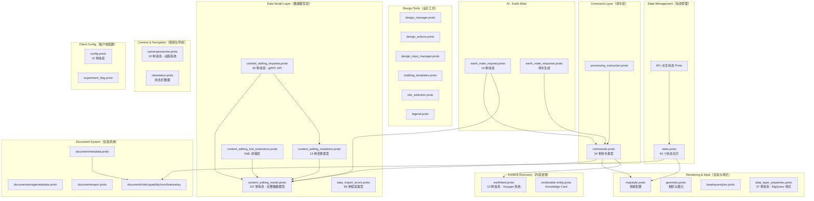

# Google Earth Studio — 完整 Proto 架构分析

> 对 `geo/earth/` 下全部 159 个 `.proto` 文件的自动生成分析
> 生成时间：2026-08-12

---

## 系统架构概览

Google Earth Studio 的 proto 层定义了 Google Earth 的完整数据模型、状态管理、命令系统和渲染管线。架构遵循以下主要领域：

| 领域 | 目录 | 用途 |
|--------|-----------|---------|
| **Core Protocol（核心协议）** | `geo/earth/proto/` | 命令、内容模型、几何、地图样式、Earth Mate AI |
| **State Management（状态管理）** | `geo/earth/app/cpp/core/state/` | 为每个 UI 组件提供 60+ 个派生状态切片 |
| **Document System（文档系统）** | `geo/earth/app/cpp/core/document/` | 文档元数据、存储、导入/导出、I/O 适配器 |
| **Design Tools（设计工具）** | `geo/earth/app/cpp/core/protos/` | 设计生成、建筑模板、绘图、单位 |
| **Layers（图层）** | `geo/earth/app/cpp/core/layers/` | 底图样式、数据图层属性、解析错误 |
| **Studio Presenters（Studio 表现层）** | `geo/earth/app/cpp/studio_presenters/` | 相机、底图、属性编辑器、设置、视图状态 |
| **View Models（视图模型）** | `geo/earth/app/cpp/presenters/` | 设计详情、设计查看器、太阳能设计输入、要素更新 |
| **Math（数学）** | `geo/earth/app/cpp/math/` | 基础几何类型 |
| **Client Config（客户端配置）** | `geo/earth/client_config/` | 特性标志、实验标志 |
| **Earth Feed（Earth 内容流）** | `geo/earth/earthfeed/proto/` | 内容发现流系统 |

---

## 1. 核心协议 — `geo/earth/proto/`

### 1.1 `geo/earth/proto/commands.proto`
- **Package:** `geo.earth.proto`
- **Messages（39）：** `Commands`、`Command`、`ClearSearchHistory`、`OpenSearchHistory`、`OpenFeelingLuckyCard`、`OpenVoyagerGrid`（已弃用）、`OpenVoyagerStory`（已弃用）、`PerformSearch`、`OpenKnowledgeCard`、`FlyToCamera`、`OpenCloudProject`、`CreateCloudProject`、`EnterTimeMachine`、`EnterTimelapse`、`OpenKmlDocument`、`OpenProjectByKey`、`OpenKmlDocumentFromContent`、`LatLngAlt`、`CreatePointPlacemark`、`EnterStreetView`、`ToggleLayer`、`SetBasemapStyle`、`CreateFeature`、`CreateFeatureTree`、`DeleteFeature`、`EditFeature`、`CreateFeaturesInFolder`、`SetHomescreenVisibility`、`ViewDesign`、`CreateDesigns`、`RenderDesign`（已弃用）、`ToggleAvailableLayersUi`、`PreviewDataLayer`、`ViewRateCard`、`OpenEarthMateChat`、`ShowLayerCardDetails`、`ViewOnDemandAnalysis`、`OpenImageGenerator`
- **Enums:** `CommandSource`
- **Imports:** `content_editing_model.proto`、`documentnamespace.proto`、`overhead_imagery.proto`、`mapstyle.proto`、`storage_restrictions.proto`、`earthfeed.proto`
- **角色：** 通用命令分发器。每个用户操作都通过一个带 **34 种命令类型** 的 `Command` oneof 流转。命令可序列化、可扩展，构成深度链接和 Earth Mate AI 操作的基础。
- **关键特性：**
  - **搜索与发现：** `PerformSearch`、`OpenKnowledgeCard`、`OpenSearchHistory`、`OpenFeelingLuckyCard`
  - **导航：** `FlyToCamera`（LookAt/LookFrom 相机、瞬移/飞行动画、POI 轨道/行星轨道/电影级展示）
  - **文档管理：** `OpenCloudProject`、`CreateCloudProject`、`OpenKmlDocument`、`OpenProjectByKey`、`OpenKmlDocumentFromContent`
  - **要素 CRUD：** `CreateFeature`、`DeleteFeature`、`EditFeature`、`CreateFeaturesInFolder`、`CreatePointPlacemark`
  - **时序功能：** `EnterTimeMachine`（历史影像）、`EnterTimelapse`（延时摄影播放）
  - **图层控制：** `ToggleLayer`（9 种图层类型：3D 建筑、延时摄影、照片、网格线、云层、已固定的项目等）、`ToggleAvailableLayersUi`、`PreviewDataLayer`、`ShowLayerCardDetails`
  - **设计生成：** `CreateDesigns`（新建建筑 / 太阳能）、`ViewDesign`
  - **AI 功能：** `OpenEarthMateChat`、`OpenImageGenerator`
  - **按需分析：** `ViewOnDemandAnalysis`（坡度、朝向、挖填方、等高线）
  - **地图样式：** `SetBasemapStyle`（卫星/路线图/地形）
  - **账单：** `ViewRateCard`
  - **街景：** `EnterStreetView`
  - 字段级注解扩展，用于 `CommandSource` 过滤

### 1.2 `geo/earth/proto/contentcreation/content_editing_model.proto`
- **Package:** `earth.document.protos`
- **Messages（107）：** 完整的 Earth 数据模型 — `Document`、`DocumentMetadata`、`DocumentProperties`、`DocumentSchema`、`DocumentContents`、`LocalVisibilityOverride`、`LocalOpenedOverride`、`FeatureProperties`、`Feature`、`Placemark`、`LatLng`、`LookAtCamera`、`LookAtCameraOptions`、`PlaceInfo`、`FeatureRestrictions`、`FeatureExportRestrictions`、`FeaturePropertiesExportRestrictions`、`FeatureEditRestrictions`、`Geometry`、`Point`、`Polyline`、`Polygon`、`StyleType`、`ContentStyle`、`ContentStyleOptions`、`IndividualStyleRule`、`IndividualStyleOptions`、`IndividualStyle`、`FeatureStyle`、`PointStyle`、`Icon`、`StockIcon`、`StockIconTextOverlay`、`CustomIcon`、`IconData`、`PixelOffset`、`PolylineStyle`、`PolygonStyle`、`BalloonStyle`、`BalloonHtmlContent`、`BalloonTemplate`、`BalloonTemplateParameter`、`LabelStyle`、`ListItemStyle`、`ListItemIconStates`、`StyleUrlList`、`Color`、`Attribute`、`AttributeValue`、`Column`、`ColumnSpec`、`MediaMutationId`、`MediaDisplayResource`、`Media`、`GroundOverlay`、`MapTilePyramid`、`Container`、`NetworkLink`、`RasterTileLayer`、`EarthDataLayer`、`EarthDataLayerProperties`、`EarthDataLayerAttributeFilters`、`CategoricalFilterSet`、`CategoricalFilter`、`RangeFilterSet`、`RangeFilter`、`DoubleRangeFilter`、`IntRangeFilter`、`EarthDataLayerGeometricFilter`、`EarthDataLayerAttributeStyles`、`ColorPalette`、`CategoricalStyleRuleSet`、`CategoricalStyleRule`、`ColorRamp`、`InterpolatedStyleRuleSet`、`CustomIntervals`、`CustomIntervalInput`、`PaintFeLayer`、`LatLngRect`、`LatLngQuad`、`CreationInfo`、`OwnerProfile`、`Orientation`、`Scale`、`BoundingBox`、`ThreeDAsset`、`Model`、`TrackSet`、`Track`、`ScreenOverlay`、`PhotoOverlay`、`ClassificationLayerInputs`、`ClassDefinition`、`SamplePoint`
- **Enums（13）：** `ModelVersion`、`FeatureModelType`、`FeatureOrigin`、`AltitudeMode`、`BaseStyleType`、`ListItemType`、`ColumnType`、`NetworkLinkType`、`NetworkLinkRefreshMode`、`TilingScheme`、`RangeFilterValueType`、`PredefinedColorPalette`、`PredefinedColorRamp`
- **Imports:** `map_type.proto`、`storage_restrictions.proto`、`protomerger/annotations.proto`
- **角色：** Earth Studio 数据模型的 **绝对核心**。定义了用于所有 KML 内容创建、编辑和渲染的完整文档/要素/几何/样式层次结构。
- **关键特性：**
  - **文档层次结构：** Document → Features 树 → Placemark/Overlay
  - **9 种要素模型类型：** Folder、Placemark、GroundOverlay、MapTilePyramid、SubDocument、NetworkLink、ScreenOverlay、PhotoOverlay、Tour
  - **几何图元：** Point、Polyline（带曲面细分）、Polygon（带环）、多几何图形集合
  - **3D 模型：** Model 带有 ThreeDAsset、Orientation、Scale、BoundingBox
  - **高度模式：** Absolute、ClampToGround、ClampToSeaFloor、RelativeToGround、RelativeToSeaFloor、RelativeToSurfaceModel
  - **相机系统：** `LookAtCamera`（LookAt 与 Camera 类型），支持街景、历史影像、日照选项
  - **完整样式系统：** PointStyle（库存/自定义图标叠加）、PolylineStyle（颜色、宽度、遮挡）、PolygonStyle（填充/边界、表面展平）、BalloonStyle（6 种显示模式：hidden/default/card/card-stack/panel/fullscreen）、LabelStyle、ListItemStyle 带图标状态
  - **气泡模板：** 参数化气泡模板，用于富信息窗口
  - **媒体系统：** 图片、YouTube 视频、变更 ID、显示资源
  - **Earth Data Layer（BigQuery）：** 完整的数据驱动样式 — 分类和插值（分级统计图）样式，20+ 预定义颜色渐变、属性过滤器（分类 + 范围）、几何过滤器（包含/相交）
  - **分类图层：** AI 驱动的土地分类，带有采样点、类别定义
  - **Map Tile Pyramid：** 栅格瓦片图层、PaintFe 图层、采用 Web Mercator 瓦片方案的 EarthDataLayer 数据源
  - **要素来源：** 用户创建 vs Gemini AI 生成的要素
  - **Schema 系统：** 基于列的数据模式，带类型化列（string/int/double/boolean）和模板别名

### 1.3 `geo/earth/proto/contentcreation/content_editing_mutations.proto`
- **Package:** `earth.document.protos`
- **Messages（18）：** `DataMutationSet`、`DataMutation`、`MetadataMutationSet`、`MetadataMutation`、`AddFeature`、`DeleteFeature`、`UpdateFeatureProperties`、`SetStyle`、`AddColumn`、`RemoveColumn`、`UpdateColumn`、`AddFeatureMedia`、`DeleteFeatureMedia`、`SetFeatureParent`、`SetFeatureIndex`、`UpdateDocumentProperties`、`UpdateStyleOptions`
- **Imports:** `content_editing_model.proto`
- **角色：** 文档编辑的变更/事务系统。每个变更都是对文档模型的原子操作。
- **关键特性：**
  - **13 种变更类型：** AddFeature、DeleteFeature、UpdateFeatureProperties、SetStyle（个体样式）、AddColumn、RemoveColumn、UpdateColumn、AddFeatureMedia、DeleteFeatureMedia、SetFeatureParent、SetFeatureIndex、UpdateDocumentProperties、UpdateStyleOptions
  - **批量变更：** `DataMutationSet` 允许分组的原子操作
  - **元数据变更：** 单独的变更路径用于文档元数据（标题、描述）

### 1.4 `geo/earth/proto/contentcreation/content_editing_requests.proto`
- **Package:** `earth.document.protos`
- **Messages（62）：** 文档编辑 RPC 系统的完整请求/响应层。包含云端文档操作（创建、获取、更新、删除、复制）、要素操作、资源上传/下载，以及长时间运行操作支持。
- **Imports:** `content_editing_model.proto`、`content_editing_mutations.proto`、`data_import_errors.proto`、`documentnamespace.proto`、`map_type.proto`、`google/longrunning/operations.proto`、`google/protobuf/timestamp.proto`、`google/type/datetime.proto`
- **角色：** gRPC 服务定义层。将数据模型与云端存储操作相连接。
- **关键特性：**
  - **文档操作：** CreateDocument、GetDocument、UpdateDocument、DeleteDocument、CopyDocument、ListDocuments
  - **要素操作：** GetFeature、BatchGetFeatures
  - **资产管理：** UploadAsset、CreateAssetUploadUrl、DownloadAsset
  - **数据导入：** ImportData，通过 `data_import_errors.proto` 进行错误处理
  - **长时间运行操作：** 使用 Google 的 LRO 模式进行异步操作
  - **资源名称：** 分层资源命名（`documents/{id}/features/{id}`）

### 1.5 `geo/earth/proto/contentcreation/content_editing_kml_extensions.proto`
- **Package:** `earth.document.protos`
- **Messages（17）：** `EditingModelExtension`、`DocumentExtension`、`ExtendedMetadata`、`EditingModelMaterializationVersion`、`StyleSelectorExtension`、`GxCascadingStyleExtension`、`MaterializedStyleLayer`、`StyleMapExtension`、`StyleExtension`、`FeatureExtension`、`ContainerExtension`、`FeatureEditRestrictionsExtension`、`GxImageExtension`、`GroundOverlayExtension`、`MapTilePyramidExtension`、`ModelExtension`
- **Enums:** `FeatureOriginExtension`
- **Imports:** `content_editing_model.proto`、`storage_restrictions.proto`
- **角色：** KML 到编辑模型的桥梁。扩展核心模型，增加 KML 特有概念（级联样式、样式映射、物化图层），这些概念超出了标准 KML。
- **关键特性：**
  - **文档扩展：** 物化版本追踪、扩展元数据（设计特性标志）
  - **样式扩展：** 托管样式、级联样式（Gx 扩展）、样式映射/选择器、带气泡模板的物化样式层
  - **要素扩展：** 托管样式标志、存储的可见性/打开状态、编辑限制、Gemini 来源追踪
  - **地面叠加层扩展：** 媒体引用、Map Tile Pyramid 扩展
  - **3D 模型扩展：** ThreeDAsset 引用

### 1.6 `geo/earth/proto/contentcreation/data_import_errors.proto`
- **Package:** `earth.document.protos`
- **Messages（66）：** 数据导入故障的完整错误分类 — 文件格式错误、解析错误、几何验证错误、Schema 错误、样式错误、网络错误、配额错误等。
- **Imports:** （仅语义注解）
- **角色：** 数据导入操作的错误目录。为每一种可能的导入失败提供结构化的、机器可读的错误详情。
- **关键特性：**
  - **66 种错误消息类型**，覆盖所有导入失败模式
  - 结构化的错误层次结构，支持程序化错误处理
  - 语义注解用于错误分类

### 1.7 `geo/earth/proto/mapstyle.proto`
- **Package:** `earth.layers`
- **Messages（1）：** `MapStyle`
- **Nested Enums:** `Projection`（Globe/Mercator）、`Imagery`（Satellite/Roadmap/Terrain）、`ThreeDFeatures`（All/TerrainOnly/None）、`BaseLayers.Preset`（Custom/Clean/Exploration/Everything）、`GridlinesLayer`（None/LatLon）
- **Imports:** `storage_restrictions.proto`
- **角色：** 定义地球仪器的完整视觉配置 — 控制用户所见一切的地图样式。
- **关键特性：**
  - **投影模式：** Globe（3D）vs Mercator（2D）
  - **基底影像：** Satellite、Roadmap 或 Terrain 底图
  - **3D 要素：** 建筑、地形 — 全部/仅地形/无
  - **视觉图层：** 云层（静态/动画）、网格线（经纬度）、3D 覆盖叠加、更新的影像叠加、土地地块、固定项目、发现图层
  - **Base Layers Preset：** 预配置图层组合（Clean/Exploration/Everything），带有自定义要素类别位掩码

### 1.8 `geo/earth/proto/geometry.proto`
- **Package:** `earth`
- **Messages（7）：** `Location`（lon/lat/alt）、`Rotation`（heading/tilt/roll）、`Size`（width/height）、`LatLng`（lat/lng）、`Camera`（location + rotation + screen_size + fov_y）、`LoggedLink`（url + anchor_text）、`RequestParameter`（name/value）
- **Imports:** 无
- **角色：** 在整个 Earth 渲染管线中使用的基础几何和相机图元。
- **关键特性：**
  - **Location：** 经度优先排序的 3D 位置
  - **Rotation：** 相机朝向的欧拉角
  - **Camera：** 完整的相机状态，带视场角
  - **LoggedLink：** 带锚文本的 URL，用于遥测
  - **RequestParameter：** 通用键值对

### 1.9 `geo/earth/proto/renderable-entity.proto`
- **Package:** `earth_knowledge`
- **Messages（约 40 个，含嵌套）：** `RenderableEntity`、`Source`、`Image` + `ImageAttribution` + `ImageDescription`、`Fact` + `FactValue`、`CardSet` + `Entity`、`LatLon`、`OpenLocationCode`、`BoundingBox`、`OpenHours` + `Day`、`Website`、`EntityThumbnailList` + `Entity`
- **Imports:** `geometry.proto`（Camera）
- **角色：** Knowledge Graph 实体模型。表示 Earth 中的丰富地点信息卡片（Knowledge Card）— 位置的"信息面板"。
- **关键特性：**
  - **地点标识：** 标题、"众所周知的"、描述、MID（机器 ID）、要素 ID
  - **富媒体：** 图片（带出处）、轮播、静态地图
  - **Knowledge Graph 事实：** 结构化事实及其来源
  - **位置数据：** 经纬度、Open Location Code、边界框、地址行
  - **商业信息：** 营业时间、电话号码、网站
  - **关联实体：** 关联地点的卡片集（例如"附近的餐厅"）
  - **实体缩略图：** 相关实体的精选列表

### 1.10 `geo/earth/proto/photos.proto`
- **Package:** `earth_photos`
- **角色：** Google Earth 照片叠加系统的照片/全景图层数据模型。

### 1.11 `geo/earth/proto/map_type.proto`
- **Package:** `earth.document`
- **Enums:** `MapType`（区分 Earth 地图与 My Maps 等）
- **角色：** 跨文档和存储系统使用的文档类型鉴别器。

### 1.12 `geo/earth/proto/documentnamespace.proto`
- **Package:** `earth.document`
- **Messages（1）：** `DocumentNamespace` 枚举
- **Imports:** `storage_restrictions.proto`
- **角色：** 文档的命名空间鉴别器（Earth vs My Maps vs 其他命名空间）。

### 1.13 `geo/earth/proto/storage_restrictions.proto`
- **Package:** `geo_earth_proto`
- **角色：** 存储限制注解，在 proto 层次结构中传播，以控制数据持久化策略。

### 1.14 `geo/earth/proto/data_layer_error_detail.proto`
- **Package:** `geo.earth.layers.proto`
- **Messages（1）：** 数据图层故障的错误详情消息
- **角色：** Earth Data Layer（BigQuery 连接的）故障的错误详情包装器。

### 1.15 `geo/earth/proto/error_response.proto`
- **Package:** `earth.document.protos`
- **Messages（1）：** `ErrorResponse` — 统一错误响应，带 oneof，用于数据导入错误、数据图层错误和 Earth Mate 错误。
- **Imports:** `data_import_errors.proto`、`data_layer_error_detail.proto`、`earth_mate_error_detail.proto`
- **角色：** 所有 Earth API 操作的统一错误响应信封。

### 1.16 `geo/earth/proto/processing_instruction.proto`
- **Package:** `geo.earth.proto`
- **Messages（2）：** `EarthProcessingInstruction`、`Instruction`（oneof: `CreateFeatureTree`）
- **Imports:** `commands.proto`
- **角色：** 服务端到客户端的处理指令 — 目前用于将预创建的要素树注入文档。

### 1.17 `geo/earth/proto/compile_time_config.proto`
- **Package:** `geo.earth.proto`
- **Messages（5）：** 编译时客户端配置
- **Imports:** `config.proto`、`google/internal/earth/v1/client_config.proto`
- **角色：** 编译时配置，被烘焙到 Earth 构建中。

### 1.18 `geo/earth/proto/bootstrap_client_config.proto`
- **Package:** `geo.earth.proto`
- **Messages（1）：** 引导客户端配置包装器
- **Imports:** `google/internal/earth/v1/client_config.proto`
- **角色：** 在完整配置可用之前，在引导时加载的初始客户端配置。

### 1.19 `geo/earth/proto/user_industry.proto`
- **Package:** `geo.earth.proto`
- **角色：** 用户行业分类（用于 Earth Mate 和特性标志定位）。

---

## 2. EARTH MATE AI — `geo/earth/proto/earth_mate/`

### 2.1 `earth_mate_request.proto`
- **Package:** `geo.earth.proto.earth_mate`
- **Messages（14）：** Earth Mate AI 助手的完整请求模型 — 包括聊天消息、文档上下文、要素上下文、图片查询、俯视影像请求和行业定位。
- **Imports:** `config_id.proto`、`content_editing_model.proto`、`documentnamespace.proto`、`file_attachment.proto`、`image.proto`、`user_industry.proto`、`google/internal/earth/v1/shared.proto`
- **角色：** Earth Mate（集成在 Google Earth 中的 Gemini 驱动 AI 助手）的请求模型。
- **关键特性：**
  - **聊天消息：** 带上下文的多轮对话
  - **文档上下文：** 对 Earth 文档的引用，用于上下文内操作
  - **要素上下文：** 特定要素引用
  - **俯视影像：** 卫星/航拍图像分析请求
  - **行业定位：** 用户行业，用于领域特定的响应
  - **文件附件：** 图片上传支持

### 2.2 `earth_mate_response.proto`
- **Package:** `geo.earth.proto.earth_mate`
- **Messages（5）：** 响应模型 — 聊天响应、待执行命令、出处、错误详情、文件附件。
- **Imports:** `commands.proto`、`earth_mate_attribution.proto`、`earth_mate_error_detail.proto`、`file_attachment.proto`
- **角色：** Earth Mate 响应 — AI 生成 Earth 可直接执行的命令。
- **关键特性：**
  - **命令生成：** Earth Mate 可输出 `Commands`（来自 `commands.proto`）供 Earth 执行
  - **出处：** AI 生成内容的来源标注
  - **错误处理：** 结构化的错误详情

### 2.3 `earth_mate_attribution.proto`
- **Package:** `geo.earth.proto.earth_mate`
- **Messages（3）：** Earth Mate 响应出处信息
- **角色：** 追踪 AI 生成内容的来源和出处。

### 2.4 `earth_mate_error_detail.proto`
- **Package:** `geo.earth.proto.earth_mate`
- **Messages（1）：** Earth Mate 专用的错误详情
- **角色：** Earth Mate 故障的结构化错误报告。

### 2.5 `file_attachment.proto`
- **Package:** `geo.earth.proto.earth_mate`
- **Messages（1）：** Earth Mate 对话的文件附件模型
- **角色：** 支持在 Earth Mate 对话中上传文件（图片等）。

### 2.6 `image.proto`
- **Package:** `geo.earth.proto`
- **Messages（1）：** Earth Mate 使用的图像数据模型
- **角色：** 在 Earth Mate 请求/响应中使用的图像表示。

### 2.7 `overhead_imagery.proto`
- **Package:** `geo.earth.proto`
- **Messages（1）：** 俯视（卫星/航拍）影像数据模型
- **Imports:** `image.proto`、`google/protobuf/timestamp.proto`
- **角色：** 用于查询和接收俯视影像分析结果的模型。

---

## 3. 状态管理 — `geo/earth/app/cpp/core/state/`

### 3.1 `state.proto`（主状态）
- **Package:** `earth.state`
- **Messages（49）：** 完整的不可恢复应用状态 — `State`、`DataState`、`NonRestorableData`（40+ 个子状态）、`LatLonBox`、`NonRestorableAppRootData`、`NonRestorableDocumentViewData`、`NonRestorableDrawingToolData`、`NonRestorableMeasureToolData`、`NonRestorableKnowledgeCardData` + 嵌套的 `StackRootCardId`/`OysterId`、`NonRestorableDroppedPinData`、`NonRestorableFeelingLuckyData`、`NonRestorableBalloonData` + `FeatureBalloonData`/`HtmlBalloonData`、`NonRestorableSearchData`、`NonRestorableStreetViewData` + `PanoId`、`NonRestorableTourData`、`NonRestorablePropertyEditorData`、`NonRestorableLightboxData`、`NonRestorableUserErrorsData`、`NonRestorableOnDocumentLoadedOperation` + `FocusDocument`/`StartPlayMode`/`OpenEditor`、`NonRestorableOnStyleLoadedOperation` + `ShowInfoForFeature`、`NonRestorableTimeMachineData`、`NonRestorableTimelapseData`、`NonRestorableLayerFeatureRequestData`、`NonRestorableCelestialData`、`NonRestorableMapStyleData`、`NonRestorableOperationProgressData`、`NonRestorableDocumentPickerData`、`NonRestorableSettingsData`、`LayerFeatureDetailsData`、`LayerFeatureAttribute`、`NonRestorableSprayPaintData`、`NonRestorableFeedbackData`、`NonRestorableCreateLinkDialogData`、`NonRestorableAccountData`、`NonRestorableMyLocationData`、`NonRestorableSiteSelectionData` + `FeatureSelection`、`NonRestorableDesignViewerData`、`NonRestorableDesignDetailsData`、`NonRestorableDesignBuiltEntityData`、`NonRestorableEarthMateData`、`NonRestorableDesignInputData`、`NonRestorableCopyDesignInputsData`、`NonRestorableAddBuildingTypesData`、`NonRestorableBuildingEditorData`、`NonRestorableGcpProjectBillingData`、`NonRestorableNavigationControlsViewData`、`NonRestorableHomescreenData`、`NonRestorablePinnedProjectsData`、`NonRestorableIndustrySelectorData`
- **Imports:** `featurekey.proto`、`drawing_mode.proto`、`view_group.proto`、`mapstyle.proto`、`google/internal/earth/v1/layers.proto`、`earth_log.proto`
- **角色：** 主应用状态。这是整个 Earth 应用中所有非持久 UI 状态的"唯一数据源"。每个功能的临时状态都在这里。
- **关键特性：**
  - **40 个不可恢复状态切片：**
    - `AppRoot` — 沉浸模式、菜单栏、启动状态、默认加载目的地
    - `DocumentView` — 聚焦文档键追踪
    - `DrawingTool` — 活动绘图模式（选择/线/点/画笔）、会话状态
    - `MeasureTool` — 坐标、绘图意图、会话状态
    - `KnowledgeCard` — 卡片栈（MID/OysterId/FeatureKey）、卡片大小、手气不错状态
    - `DroppedPin` — 纬度/经度/精度、地标可见性
    - `FeelingLucky` — 请求计数、请求状态（pending/failed）
    - `Balloon` — 要素气泡（按键索引）、HTML 气泡、图层要素详情（打开时飞行至）
    - `Search` — 面板状态、查询、光标位置、视口、结果、历史记录
    - `StreetView` — 全景 ID 及前端类型、覆盖叠加层、时间线控件
    - `Tour` — 导览播放器可见性
    - `PropertyEditor` — 编辑器文档键、文档视图栈可见性、会话状态
    - `Lightbox` — 可见性开关
    - `UserErrors` — 已抑制状态
    - `OnDocumentLoadedOperation` — 延迟操作：聚焦、播放模式、打开编辑器、飞行至
    - `OnStyleLoadedOperation` — 样式加载后显示要素信息
    - `TimeMachine` — 启用/展开/日期配置
    - `Timelapse` — 播放状态：启用、展开、播放中、帧率倍率、暂停年份
    - `LayerFeatureRequest` — 特定要素/图层请求追踪
    - `Celestial` — 24 个天体（太阳、所有行星、主要卫星，包括 Titan、Europa、Enceladus 等）、天体时间、日期/时间切换
    - `MapStyle` — 默认/voyager 地图样式、发现图层、POI 折叠、会话状态
    - `OperationProgress` — 7 种任务类型（导入至云端的各个阶段、粘贴操作）
    - `DocumentPicker` — 可见性
    - `Settings` — 可见性、会话状态
    - `SprayPaint` — 面板可见性
    - `Feedback` — 对话框可见性、产品特定数据
    - `CreateLinkDialog` — 可见性
    - `Account` — 登录状态、Earth/MyMaps/Drive 启用
    - `MyLocation` — 位置权限状态、追踪状态（off/requesting/tracking/following camera）
    - `SiteSelection` — 会话状态、已选要素键
    - `DesignViewer` — 会话状态
    - `DesignDetails` — 会话状态
    - `DesignBuiltEntity` — 会话状态、已选建筑实体 ID
    - `EarthMate` — 聊天活动状态
    - `DesignInput` — 设计输入模式（inactive/selecting/solar/new build/site selection）、建筑类型、建筑编辑器、复制设计输入
    - `GcpProjectBilling` — 会话状态、账单升级对话框来源
    - `NavigationControls` — 会话状态
    - `Homescreen` — 首次加载后打开、已关闭状态
    - `PinnedProjects` — 对话框可见性
    - `IndustrySelector` — 调查对话框、横幅可见性、活动视图

### 3.2 状态切片文件（60+ 个派生状态 proto）

每个文件为特定 UI 组件定义一个单独的 `DerivedState` 消息。所有文件共享 package `earth.state.derivedstate`。

| 文件 | 核心角色 |
|------|----------|
| `addbuildingtypes/` | 建筑类型选择 UI 状态 |
| `approot/` | 从 `ViewGroup`、`content_editing_model`、`mapstyle` 派生的根级应用状态 |
| `apptheme/` | 主题配置状态 |
| `backnavigation/` | 返回导航栈状态 |
| `balloon/` | 从 `featurekey` 和 `content_editing_model` 派生的气泡显示状态 |
| `bottomsheet/` | 底部面板 UI 状态 |
| `buildingeditor/` | 建筑编辑器工具状态 |
| `buildingtemplatesmanager/` | 建筑模板管理器状态 |
| `card/` | 卡片显示状态 |
| `carddock/` | 卡片停靠布局状态 |
| `celestial/` | 天体选择状态 |
| `collapsedwidgets/` | 折叠部件追踪 |
| `copydesigninputsdialog/` | 复制设计输入对话框状态 |
| `createlinkdialog/` | 创建链接对话框，带 `featurekey` |
| `deeplink/` | **深度链接状态（12 种消息）** — CameraState、LegacyDataState 包含 ALL 可深度链接的状态：要素数据（EarthFeed、KnowledgeCard、Search、TimeMachine、Timelapse、BasemapStyle、OnDemandAnalysis）、Drive 数据、Session 数据、Homescreen 数据、Design 数据、Document 数据、EarthMate 数据 |
| `deletedocumentdialog/` | 删除文档对话框状态 |
| `designbuiltentity/` | 设计建筑实体查看器状态 |
| `designdetails/` | 设计详情面板状态 |
| `designinputmanager/` | 设计输入管理器状态 |
| `designinputmodechooser/` | 设计输入模式选择器 UI |
| `designmanager/` | 设计管理器状态 |
| `designviewer/` | 设计查看器状态 |
| `document/` | 文档视图状态 |
| `documentlistview/` | 文档列表视图状态 |
| `documentmanager/` | 文档管理器，带 `state.proto` 引用 |
| `documentview/` | 文档视图状态 |
| `draftinputmanager/` | 草稿输入管理器状态 |
| `drawingtool/` | 绘图工具状态，带 `featurekey` 和 `drawing_mode` |
| `droppedpin/` | 放置图钉状态 |
| `earthmate/` | Earth Mate UI 状态 |
| `earthmatemanager/` | Earth Mate 管理器，带 `content_editing_model` 和 `documentnamespace` |
| `earthrender/` | Earth 渲染器状态，带 `view_group` |
| `featurecategoryflags/` | 要素类别标志状态 |
| `feedback/` | 反馈对话框状态 |
| `gcpprojectbilling/` | GCP 项目账单状态 |
| `homescreen/` | 主屏幕状态 |
| `hoverbutton/` | 悬停按钮状态 |
| `industryselector/` | 行业选择器状态 |
| `info/infopickmanager/` | 信息拾取管理器状态 |
| `inspector/` | 检查器面板状态 |
| `layerdetails/` | 图层详情面板状态 |
| `layers/` | 图层面板状态 |
| `leftpanel/` | 左侧面板布局状态 |
| `localfilesystem/` | 本地文件系统状态 |
| `logging/` | 日志状态 |
| `maintoolbar/` | 主工具栏状态 |
| `mapspaceediting/` | 地图空间编辑状态 |
| `measuretool/` | 测量工具状态 |
| `menubar/` | 菜单栏状态 |
| `mylocation/` | 我的位置状态 |
| `navigationcontrols/` | 导航控件状态 |
| `newbuilddesigninput/` | 新建建筑设计输入状态 |
| `onboarding/` | 引导流程状态 |
| `picking/` | 拾取/选择状态 |
| `pinnedprojects/` | 已固定项目状态 |
| `promotion/` | 推广横幅状态 |
| `propertyeditor/` | 属性编辑器状态 |
| `search/` | 搜索 UI 状态 |
| `shortcuts/` | 键盘快捷键，带 `mapstyle` 引用 |
| `sitemanager/` | 场地管理器状态 |
| `siteselection/` | 选址，带 `state.proto` 引用 |
| `solardesigninput/` | 太阳能设计输入状态 |
| `spraypaint/` | 喷绘工具状态 |
| `streetview/` | 街景状态，带 `state.proto` 引用 |
| `timelapse/` | 延时摄影状态 |
| `timemachine/` | 时光机状态 |
| `toptoolbar/` | 顶部工具栏状态，带 `mapstyle` 引用 |
| `usererrors/` | 用户错误状态 |
| `viewstatus/` | 视图状态栏状态 |

---

## 4. 文档系统 — `geo/earth/app/cpp/core/document/`

### 4.1 `documentmetadata.proto`
- **Package:** `earth.document`
- **Messages（6）：** `DocumentMetadata`、`RequestQueueState`、枚举 `IoOperation`、`QueueState`、`Error`、`SharingVisibility`、`StorageIcon`、`DocumentKind`
- **Imports:** `capability.proto`、`icon.proto`、`role.proto`、`documentnamespace.proto`、`map_type.proto`
- **角色：** 运行时文档元数据 — 追踪已加载文档的所有信息：I/O 状态、队列状态、共享、所有权、存储、固定等。
- **关键特性：**
  - **I/O 状态机：** 7 种 I/O 操作（load/create/copy/remove/mutate/reload）
  - **请求队列：** 6 种队列状态（idle/awaiting/paused/discarding/retrying），带 7 种错误类型
  - **元数据：** 标题、描述、摘要、缩略图、主图、图标、共享可见性
  - **时间戳：** 最后修改、最后访问、最后聚焦
  - **特性：** 已固定、已聚焦、可能可见、有气泡、编辑进行中
  - **权限：** 能力列表、角色（owner/editor/viewer）、访问被拒绝追踪
  - **存储：** 存储图标、恢复状态、已消耗配额、文档命名空间
  - **触摸：** 触摸选择模式、待处理选择计数

### 4.2 `documentstoragemetadata.proto`
- **Package:** `earth.document`
- **Messages（2）：** 存储特定元数据（持久化文档信息）
- **Imports:** `icon.proto`、`role.proto`、`documentnamespace.proto`、`map_type.proto`、`storage_restrictions.proto`
- **角色：** 文档的持久化存储元数据，与运行时状态分离。

### 4.3 `documentimport.proto`
- **Package:** `earth.documentimport`
- **Messages（11）：** 完整导入系统 — `ImportRequest`、`ImportResponse`、文件来源类型、进度追踪、错误处理。
- **Imports:** `data_import_errors.proto`、`error_response.proto`、`google/protobuf/timestamp.proto`
- **角色：** 文档导入管道 — 处理导入 KML、KMZ、CSV、GeoJSON 及其他格式。
- **关键特性：**
  - 文件来源指定（本地、云端、URL）
  - 带时间戳的进度追踪
  - 通过 `data_import_errors.proto` 进行结构化错误报告
  - 多格式导入支持

### 4.4 `capability.proto`
- **Package:** `earth.document`
- **Messages（2）：** `Capability` 带能力类型枚举
- **角色：** 文档能力/权限标志（例如 can export、can share、can delete）。

### 4.5 `role.proto`
- **Package:** `earth.document`
- **Messages（2）：** `Role` 枚举 + 包装器
- **Imports:** `storage_restrictions.proto`
- **角色：** 用户在文档中的角色（Owner、Editor、Viewer）。

### 4.6 `icon.proto`
- **Package:** `earth.document`
- **Messages（2）：** `Icon` 带图标类型和颜色
- **Imports:** `storage_restrictions.proto`
- **角色：** 文档列表中使用的文档图标表示。

### 4.7 `featureicon.proto`
- **Package:** `earth.document`
- **Messages（2）：** 要素图标，带图标类型
- **角色：** 要素级图标表示。

### 4.8 `featurekey.proto`
- **Package:** `earth.document.proto`
- **Messages（1）：** `FeatureKey`（document_key + feature_id）
- **角色：** 在整个代码库中使用的通用要素标识符 — 将文档键与要素 ID 配对。

### 4.9 `balloontemplate.proto`
- **Package:** `earth.document`
- **Messages（3）：** 气泡模板定义
- **Imports:** `localizedmessage.proto`
- **角色：** 信息窗口的气泡模板注册表。

### 4.10 `localizedmessage.proto`
- **Package:** `earth.document`
- **Messages（1）：** 本地化消息包装器
- **角色：** 文档相关字符串的 i18n 支持。

### 4.11 I/O 适配器
- **`ioadapters/externalfilesystemadapter/external_file_system_capabilities.proto`** — 外部文件系统能力
- **`ioadapters/localfilesystemadapter/lfs_adapter_capabilities.proto`** — 本地文件系统适配器能力
- **`ioadapters/umsadapter/ums_adapter_capabilities.proto`** — UMS（用户管理存储）适配器能力

---

## 5. 设计与工具 PROTO — `geo/earth/app/cpp/core/protos/`

### 5.1 `design_manager.proto`
- **Package:** `earth.design`
- **Messages（6）：** `DesignResult`、`DesignMapResult`、`Sort`、`Filter`、`Query`、`QueryKey`
- **Imports:** `built_entity.proto`、`built_environment.proto`、`design_content.proto`、`metrics.proto`
- **角色：** 设计生成结果和查询模型。管理 AI 驱动的建筑/太阳能设计生成的输出。
- **关键特性：**
  - **设计结果：** 设计 ID、名称、状态、类型、汇总指标、缩略图、建筑实体、可下载文件、设计标签、已保存标志
  - **查询模型：** 可排序（按更新时间或综合评分）、可过滤（按输入 ID、已保存状态、设计状态）
  - **地图集成：** `DesignMapResult` 用于设计的地图叠加

### 5.2 `design_actions.proto`
- **Package:** `earth.design`
- **Messages（4）：** `DownloadDesignFileRequest`、`DownloadDesignFileResponse`、`NewBuildToplineMetrics`、`SolarToplineMetrics`
- **Imports:** `built_environment.proto`
- **角色：** 设计文件下载和设计生成的主要指标。
- **关键特性：**
  - **新建建筑指标：** GFA（平方米）、成本利润率、排放变化、基准排放
  - **太阳能指标：** 安装规模、年度发电量、排放变化、基准排放

### 5.3 `design_input_manager.proto`
- **Package:** `earth.designinput`
- **Messages（3）：** `DesignGenerationResult`、枚举 `GenerateDesignsRequestState`、`MaxSiteAreaState`
- **Imports:** `built_environment.proto`、`new_build_run_inputs.proto`、`google/protobuf/timestamp.proto`
- **角色：** 设计生成输入追踪 — 管理设计生成请求的生命周期。
- **关键特性：**
  - **设计生成输入：** 用途类型输入、可持续性输入、单元组合输入、通用运行输入
  - **设计输入类型：** New Build 与 Solar
  - **请求状态机：** Before → In Progress → Complete
  - **场地面积限制：** 6 种最大场地面积状态（not exceeded、billing disabled、highest capability、other license、plan upgrade）

### 5.4 `building_templates.proto`
- **Package:** `earth.buildingtemplates`
- **Messages（2）：** `BuildingTemplateFarRangeInfo`、`BuildingTemplateInfo`
- **Enum:** `FarRangeCategory`（Unknown/Low/Medium/High）
- **Imports:** `building_configuration.proto`、`building_far_range.proto`
- **角色：** 新建建筑设计生成的建筑模板注册表。将模板映射到 FAR（容积率）范围。
- **关键特性：**
  - 建筑模板 ID → 配置映射
  - FAR 范围分类（Low/Medium/High）
  - 建筑模板类型分类

### 5.5 `site_selection.proto`
- **Package:** `earth.siteselection`
- **Messages（2）：** `Parcel`（name + polygon）、`SiteSelectionResult`（重复的 parcels）
- **Imports:** `content_editing_model.proto`
- **角色：** 选址结果 — 选址查询返回的地块。
- **关键特性：** 基于地块的选址，带多边形几何

### 5.6 `drawing_mode.proto`
- **Package:** `earth.core.drawingmode`
- **Enums:** `DrawingMode`（Unknown/Selection/LineString/Point/Brush）
- **角色：** 绘图工具模式枚举。

### 5.7 `polygon_input_mode.proto`
- **Package:** `earth.core.protos`
- **Messages（4）：** 多边形输入模式状态机
- **角色：** 追踪多边形绘制输入状态。

### 5.8 `legend.proto`
- **Package:** `earth.legend`
- **Messages（8）：** `HSVColor`、`Item`、`Categorical`、`ChoroplethContinuous`、`ChoroplethDiscrete`（Custom/Interpolated）、`LegendLayer`、`LegendSection`、`Legend`
- **Imports:** `unit_type.proto`、`l10n_message_id.proto`、`content_editing_model.proto`
- **角色：** 设计工具的地图图例系统 — 为新建建筑和太阳能设计图层渲染分类图和分级统计图图例。
- **关键特性：**
  - **图层类型：** New Build（按建筑用途类型、公寓类型）、Solar、Solar Energy Potential、Ground Sunlight Hours
  - **图例类型：** 分类图例、连续分级统计图、离散分级统计图（自定义区间或插值）
  - **格式化：** 货币代码、单位类型（公制/英制）
  - **i18n：** 通过消息 ID 本地化的名称

### 5.9 `lightbox_data.proto`
- **Package:** `earth.core.lightbox`
- **Messages（5）：** `MediaAttribution`、`YoutubeVideo`、`LightboxMedia`、`LightboxData`
- **Enum:** `LightboxMode`（Gallery/Image）
- **角色：** 灯箱画廊系统 — 带出处的媒体查看器。
- **关键特性：** 图片字节/URL、YouTube 视频嵌入、出处（标题、作者、版权、反馈 URL）、画廊 vs 单图模式

### 5.10 `model_context.proto`
- **Package:** `earth.modelcontext`
- **Messages（4）：** `Schema`、`Update`、`Context`、`Resource`
- **Imports:** `google/protobuf/any.proto`、`google/protobuf/field_mask.proto`
- **角色：** 通用模型上下文系统 — Schema 定义、带字段掩码的更新、上下文 URI 和用于 AI 模型集成的资源模板。
- **关键特性：** 灵活的值类型（text/binary/proto）、URI 模板、参数映射

### 5.11 `units.proto`
- **Package:** `earth.core.units`
- **Messages（3）：** 测量单位系统
- **角色：** 测量单位定义与转换。

### 5.12 `unit_type.proto`
- **Package:** `earth.core.unittype`
- **Messages（2）：** 单位类型枚举
- **角色：** 单位类型分类（长度、面积、体积、货币等）。

### 5.13 `view_group.proto`
- **Package:** `earth.core.viewgroup`
- **Messages（3）：** `ViewGroup`、`View`、`ViewId` 枚举（100+ 个视图 ID）
- **角色：** 视图层次结构 — 将每个 UI 面板/组件映射到 ID，用于状态管理和焦点追踪。
- **关键特性：** 100+ 个视图 ID，覆盖整个 Earth UI（气泡、卡片停靠、设计工具、绘图工具、Earth Mate、飞行模拟器、地球仪、检查器、图层、测量工具、属性编辑器、搜索、街景、延时摄影等）

### 5.14 `document_export_data.proto`
- **Package:** `earth.documentexport`
- **Messages（2）：** 导出数据模型
- **角色：** 文档导出配置。

### 5.15 `document_operation_status.proto`
- **Package:** `earth.documentstatus`
- **Messages（6）：** 操作状态追踪，带本地化消息
- **Imports:** `localized_message.proto`、`google/protobuf/timestamp.proto`
- **角色：** 追踪文档操作（导入、导出、变更）的状态，显示进度和错误状态。

### 5.16 `localized_message.proto`
- **Package:** `earth.core`
- **Messages（4）：** 本地化消息，带消息 ID
- **Imports:** `l10n_message_id.proto`
- **角色：** 核心 i18n 消息基础设施。

---

## 6. 图层系统 — `geo/earth/app/cpp/core/layers/`

### 6.1 `baselayerstyles.proto`
- **Package:** `earth.layers`
- **Messages（7）：** 底图样式定义
- **Imports:** `mapstyle.proto`
- **角色：** 预定义的底图样式预设和自定义。

### 6.2 `data_layer_properties.proto`
- **Package:** `earth.layers`
- **Messages（37）：** `EarthDataLayerProperties`、`EarthDataLayerAttributeFilters`、`CategoricalFilterSet`、`CategoricalFilter`、`RangeFilterSet`、`RangeFilter`、`DoubleRangeFilter`、`IntRangeFilter`、`EarthDataLayerGeometricFilter` + `GeometricOperator`、`Geometry`/`Point`/`Polyline`/`Polygon`、`EarthDataLayerAttributeStyles`、`ColorPalette`、`CategoricalStyleRuleSet`、`CategoricalStyleRule`、`ColorRamp`、`InterpolatedStyleRuleSet`、`CustomIntervals`、`CustomIntervalInput`、`LatLng`、`AltitudeMode` 等
- **角色：** Earth Data Layer（BigQuery 连接）的样式和过滤。镜像 `content_editing_model` 等价的模型，但用于图层属性系统。
- **关键特性：**
  - **样式策略：** Uniform 与 Data-Driven
  - **属性过滤器：** Categorical（按值启用/禁用）和 Range（double/int，带包含/排除边界）
  - **几何过滤器：** Contains/Intersects 操作符
  - **数据驱动样式：** Categorical 规则（按值样式，带用户定义标签/颜色）、Interpolated 规则（线性/区间，带自定义区间）
  - **调色板：** 预定义调色板（default、contrasting、rainbow、bright、cool、warm）
  - **颜色渐变：** Material Design 渐变和单色/双色渐变
  - **分类：** 自定义区间分类

### 6.3 `layer_resolve_errors.proto`
- **Package:** `earth.layers`
- **Messages（1）：** 图层解析错误详情
- **Imports:** `google/internal/earth/v1/billing/capability.proto`
- **角色：** 图层解析失败（账单、权限等）的错误报告。

---

## 7. STUDIO 表现层 — `geo/earth/app/cpp/studio_presenters/`

### 7.1 `camera/camerapresenter.proto`
- **Package:** `earth.studio.camera`
- **Messages（10）：** `CameraUpdate`、`Intersection`、`CameraInfo`、`CameraTransformation`、`CameraPosition`、`Copyrights`
- **Enums:** `Trajectory`（Linear/Parabolic/Contextual）、`Presentation`（Static/POI Orbit/Planet Orbit/Cinematic）、`UpdateMode`、`ViewUpdateType`
- **角色：** 相机动画系统 — 控制 Earth 中的每一次相机移动，包含轨迹类型、展示模式和交叉测试。
- **关键特性：**
  - **CameraInfo：** 每个属性的 oneof，用于纬度/经度/高度/航向/倾斜/翻滚/范围/fovy/pano_id，每个字段都带有 "use_current" 选项，用于部分更新
  - **Camera Transformation：** 相机目标 + 轨迹 + 展示模式 + 持续时间
  - **Camera Position：** 双 LookAt/LookFrom 相机表示
  - **Trajectories：** Linear、Parabolic、Contextual 飞行路径
  - **Presentation Modes：** Static、POI Orbit、Planet Orbit、Cinematic
  - **Intersection Testing：** 与地形的射线投射交叉
  - **Copyrights：** 影像提供商出处

### 7.2 `baselayer/baselayers.proto`
- **Package:** `earth.studio.layers`
- **Messages（3）：** Studio 的底图配置
- **角色：** Studio 专用的底图管理。

### 7.3 `propertyeditor/allowedtemplateids.proto`
- **Package:** `earth.studio.propertyeditor`
- **Messages（1）：** 允许的气泡模板 ID
- **角色：** 限制属性编辑器中可用的气泡模板。

### 7.4 `propertyeditor/recenticons.proto`
- **Package:** `earth.studio.propertyeditor`
- **Messages（2）：** 最近使用的图标追踪
- **Imports:** `localizedmessage.proto`
- **角色：** 属性编辑器中图标选择器的最近使用图标列表。

### 7.5 `propertyeditor/stockicons.proto`
- **Package:** `earth.studio.propertyeditor`
- **Messages（3）：** 库存图标目录
- **Imports:** `localizedmessage.proto`
- **角色：** 地标的预定义库存图标库。

### 7.6 `settings/settings.proto`
- **Package:** `earth.studio.settings`
- **Messages（1）：** 设置配置
- **角色：** 应用设置模型。

### 7.7 `viewstatus/viewstatus.proto`
- **Package:** `earth.studio.viewstatus`
- **Messages（6）：** `ImageryAcquisitionDateRange`、`AltitudeWithUnits`、`ViewStatus` + `Coordinates`、`PointerCoordinates`、`LoadProgress`
- **Enum:** `DistanceUnits`（cm/m/km/in/ft/mi）
- **角色：** 视图状态栏数据 — 在 Earth 状态栏中显示的信息：版权、坐标、高度、影像日期、加载进度。
- **关键特性：**
  - **Coordinates：** 格式化和原始的 纬度/经度/高度，带航向、范围、倾斜
  - **Altitude Display：** 米 + 单位感知显示（cm/m/km 或 in/ft/mi）
  - **Imagery Dates：** 采集日期范围，带未知日期处理
  - **Copyrights：** 提供商列表
  - **Street View：** 活动模式指示器
  - **Pointer Coordinates：** 鼠标悬停坐标显示
  - **Load Progress：** 不定/确定进度类型

---

## 8. 视图模型 — `geo/earth/app/cpp/presenters/`

### 8.1 `designdetails/designdetailsviewmodel.proto`
- **Package:** `earth.designdetails`
- **Messages（21）：** 完整的设计详情视图模型 — 设计信息、建筑实体、指标、可下载文件、设计操作。
- **Imports:** `design_actions.proto`、`built_entity.proto`、`built_environment.proto`、`design_content.proto`、`metrics.proto`、`use_type_class.proto`、`google/protobuf/timestamp.proto`
- **角色：** 设计详情面板的视图模型 — 向用户展示 AI 生成的设计信息。
- **关键特性：**
  - 设计元数据（名称、类型、状态、标签）
  - 建筑实体可视化数据
  - 汇总指标（GFA、利润、排放、太阳能潜力）
  - 可下载文件列表
  - 设计操作（下载、保存、删除）

### 8.2 `designviewer/designviewerviewmodel.proto`
- **Package:** `earth.designviewer`
- **Messages（2）：** 设计查看器视图模型
- **Imports:** `design_actions.proto`、`design_manager.proto`、`designdetailsviewmodel.proto`、`built_environment.proto`
- **角色：** 设计查看器的视图模型 — 生成设计的 3D 预览。

### 8.3 `propertyeditor/featureupdater/featureupdate.proto`
- **Package:** `earth.featureupdater`
- **Messages（52）：** 完整的要素更新系统 — `LatLngRect`、`LatLngQuad`、`Coordinate`、`CoordinateUpdate`（带 Mask/Field 枚举）、`LookAtCamera`、`LookAtCameraUpdate`（带 Mask/Field 枚举），以及 40+ 个属性特定更新消息，覆盖每个要素属性（标题、描述、可见性、图标、颜色、几何、样式、气泡、高度模式等）
- **Imports:** `basic_types.proto`
- **角色：** 要素属性编辑器的更新协议。每个属性更改都表示为一个更新消息，带字段掩码用于选择性更新。
- **关键特性：**
  - **Masked Updates：** 每个更新消息都有一个 `Mask`，具有字段级粒度
  - **Coordinate Updates：** 纬度、经度、高度、高度模式
  - **Camera Updates：** 完整的 LookAt 相机，包含所有字段 + pano ID、lookat 类型
  - **Geometry Updates：** Point/Line/Polygon 坐标修改
  - **Style Updates：** 颜色、图标、标签、气泡样式更改
  - **Property Updates：** 标题、描述、摘要、地址、可见性
  - **约 52 种消息类型**，覆盖每个可编辑的要素属性

### 8.4 `solardesigninput/solardesigninputviewmodel.proto`
- **Package:** `earth.solardesigninput`
- **Messages（5）：** 太阳能设计输入视图模型
- **Imports:** `design_input_manager.proto`
- **角色：** 太阳能设计输入面板的视图模型。

---

## 9. 数学类型 — `geo/earth/app/cpp/math/`

### 9.1 `basic_types.proto`
- **Package:** `earth.math`
- **Messages（10）：** `RgbColor`（red/green/blue）、`LatLng`（lat/lng）、`LatLngAlt`（lat/lng/alt）、`Matrix4`（packed double[16]）、`Vector3`（x/y/z）、`BoundingBox2d`（x/y min/max）、`BoundingBox3d`（x/y/z min/max）、`Orientation`（heading/tilt/roll）、`Scale3d`（x/y/z）、`Size2d`（width/height）
- **角色：** 在渲染和编辑管线中使用的数学基础类型。
- **关键特性：**
  - **3D 数学：** Vector3、Matrix4（4x4 变换）
  - **地理坐标：** LatLng、LatLngAlt
  - **边界框：** 2D 和 3D 轴对齐边界框
  - **变换：** Orientation（欧拉角）、Scale3d
  - **颜色：** RGB 颜色
  - **尺寸：** 2D 尺寸

---

## 10. 客户端配置 — `geo/earth/client_config/`

### 10.1 `config.proto`
- **Package:** `earth.config`
- **Messages（15）：** 完整的客户端配置 — 特性标志、服务器端点、实验标志、客户端行为设置。
- **Imports:** `experiment_flag.proto`、`google/internal/earth/v1/client_config.proto`、`google/internal/earth/v1/shared.proto`
- **角色：** 运行时客户端配置，控制特性可用性、实验注册和服务器通信。
- **关键特性：**
  - 特性标志系统
  - 实验标志集成
  - 服务器端点配置
  - 客户端行为开关

### 10.2 `experiment_flag.proto`
- **Package:** `earth`
- **Messages（1）：** 实验标志定义
- **角色：** 用于特性门控和 A/B 测试的实验标志类型。

---

## 11. EARTH FEED — `geo/earth/earthfeed/proto/`

### 11.1 `earthfeed.proto`
- **Package:** `earthfeed`
- **Messages（10）：** `EarthFeedPublishMetadata`、`EarthFeedList`、`EarthFeed`、`EarthFeedCategory` + `DisplayType` 枚举（17 种显示类型）、`Image`、`EarthLayerId` + `EarthLayerCategory`、`ItemAction` + `Trajectory`/`PresentationMode` 枚举、`SpecialFeature` + `SpecialFeatureType`、`EarthFeedItem` + `Tag` 枚举（13 种标签）
- **Imports:** `mapstyle.proto`、`storage_restrictions.proto`
- **角色：** Voyager/Discovery 内容流系统 — 驱动 Earth 中的"I'm Feeling Lucky"、Voyager 故事和内容发现功能。
- **关键特性：**
  - **内容类别：** 17 种显示类型（Carousel、Featured、Global Awareness、History、Imagery、Travel、Nature、Culture、Education、Sports、Library、Layers、Games、Street View）
  - **流项目：** 标题、描述、图片、内容 URL、项目操作
  - **项目操作：** 目标要素、播放导览、显示气泡、飞行至（带轨迹：parabolic/teleport/contextual）和展示模式（static/orbit/cinematic）
  - **图层控制：** 打开流项目时启用特定 Earth 图层
  - **地图样式：** 每个流项目的自定义地图样式
  - **特殊功能：** 目录标记
  - **标签系统：** 13 种内容标签（Global Awareness 等）
  - **本地化：** 按区域设置的流
  - **发布：** 发布时间戳元数据

---

## 12. 支持文件 — `geo/earth/app/cpp/core/`

### 12.1 `account/authinfo.proto`
- **Package:** `earth.account`
- **Messages（4）：** 身份验证和账户信息
- **角色：** 用户身份验证状态和账户信息。

### 12.2 `arguments.proto`
- **Package:** `earth`
- **Messages（1）：** 应用启动参数
- **Imports:** `config_id.proto`
- **角色：** 解析并表示应用启动参数。

### 12.3 `config_id.proto`
- **Package:** `earth`
- **Messages（2）：** 配置标识符
- **角色：** 唯一配置版本标识符。

### 12.4 `earthmate/debug_options.proto`
- **Package:** `earth.earthmate`
- **Messages（2）：** Earth Mate 调试配置
- **角色：** Earth Mate AI 开发的调试选项。

### 12.5 `experiments/experiment_flags.proto`
- **Package:** `earth.experiments`
- **Messages（2）：** 实验标志状态
- **Imports:** `experiment_flag.proto`
- **角色：** 运行时实验标志状态追踪。

### 12.6 `info/featureinfo.proto`
- **Package:** `earth.info`
- **Messages（9）：** 要素信息显示模型
- **Imports:** `localized_message.proto`、`basic_types.proto`
- **角色：** 要素信息面板数据（点击要素时显示的资讯卡片）。

### 12.7 `kmltree/update.proto`
- **Package:** `earth.kmltree`
- **Messages（4）：** KML 树更新模型
- **Imports:** `capability.proto`、`featureicon.proto`、`featurekey.proto`、`legend.proto`、`content_editing_model.proto`
- **角色：** KML 树视图（文档图层面板）更新模型 — 管理分层要素树的显示。

### 12.8 `localfilesystem/localfilesystem.proto`
- **Package:** `earth.localfilesystem`
- **Messages（1）：** 本地文件系统状态
- **角色：** 本地文件系统访问状态追踪。

### 12.9 `localizedstrings.proto`
- **Package:** `earth`
- **Messages（2）：** 本地化字符串目录
- **角色：** 应用级 i18n 字符串基础设施。

### 12.10 `styleeditor/recenticons.proto`
- **Package:** `earth.styleeditor`
- **Messages（2）：** 样式编辑器的最近使用图标
- **Imports:** `localizedmessage.proto`
- **角色：** 追踪样式编辑器中最近使用的图标。

### 12.11 `styleeditor/stockicons.proto`
- **Package:** `earth.styleeditor`
- **Messages（3）：** 样式编辑器的库存图标库
- **Imports:** `localizedmessage.proto`
- **角色：** 样式编辑器的预定义库存图标目录。

---

## 13. 应用级 — `geo/earth/app/`

### 13.1 `l10n_message_id.proto`
- **Package:** `earth.core`
- **Messages（1）：** `L10nMessageId` 带 `MessageId` 枚举（大量本地化消息 ID 列表）
- **角色：** 整个 Earth 应用本地化系统的中央消息 ID 注册表。

---

## 系统架构图

---

## 关键架构模式

### 1. **命令模式（Command Pattern）**
所有用户操作和 AI 生成的操作都通过 `commands.proto` 中的 `Command` 系统流转。34 种命令类型中的每一种都是一个自包含的操作消息，可以：
- 被序列化用于深度链接
- 由 Earth Mate AI 生成
- 被排队并按顺序执行
- 被来源标记（deep link、search、Earth Mate、internal）

### 2. **Document-Feature 层次结构**
整个内容模型遵循：`Document` → `DocumentContents` → `Feature[]`（树）→ `FeatureProperties` → `Placemark`/`GroundOverlay`/`MapTilePyramid` 等。要素可以包含子要素（文件夹）、媒体和样式。这镜像了 KML 语义，但以云原生的 protobuf 格式存储。

### 3. **样式级联（Style Cascade）**
三个样式级别：`ContentStyle`（文档级规则）→ `IndividualStyleRule`（按要素覆盖）→ `FeatureStyle`（已解析样式）。要素可以有 `PointStyle`、`PolylineStyle`、`PolygonStyle`、`BalloonStyle`、`LabelStyle` 和 `ListItemStyle`。

### 4. **数据驱动样式（Data-Driven Styling，BigQuery Earth Data Layers）**
`EarthDataLayer` 属性支持两种样式策略：
- **Uniform（统一）：** 对所有要素应用单一样式
- **Data-Driven（数据驱动）：** 分类规则（按值颜色）或插值规则（带自定义区间的连续颜色渐变）
- 结合属性过滤器（分类复选框 + 范围滑块）和几何过滤器（contains/intersects）

### 5. **基于变更的编辑（Mutation-Based Editing）**
文档编辑遵循类 CQRS 模式：`DataMutation` 消息表示原子变更。变更在 `DataMutationSet` 中批量处理并在服务端应用。这使撤销/重做、离线排队和冲突解决成为可能。

### 6. **状态管理（State Management）**
`state.proto` 文件包含 40 个 `NonRestorable*` 状态切片 — 所有不应在会话间持久化的临时 UI 状态。每个 UI 组件都获得自己的 `DerivedState` proto，从核心状态派生可视化数据。

### 7. **Presenter/ViewModel 模式**
`studio_presenters/` 定义 UI 表现层的数据契约。`presenters/` 定义视图模型 — UI 代码直接消费的数据结构。这将业务逻辑（表现层）与 UI 渲染（视图模型）清晰地分离。

### 8. **设计生成管道（Design Generation Pipeline）**
New Build 和 Solar 设计生成流经：
1. `CreateDesigns` 命令
2. `DesignGenerationInput` 追踪（`design_input_manager.proto`）
3. AI 处理（服务端，不在这些 proto 中）
4. `DesignResult` 交付（`design_manager.proto`）
5. `DesignDetailsViewModel` 展示
6. `BuildingTemplates` 用于基于 FAR 的建筑配置

### 9. **相机动画系统（Camera Animation System）**
`camerapresenter.proto` 提供丰富的动画系统：
- **Trajectories（轨迹）：** Linear（直线）、Parabolic（弧线）、Contextual（智能路径）
- **Presentations（展示）：** Static、POI Orbit、Planet Orbit、Cinematic
- **Partial Updates（部分更新）：** 每个相机属性可指定 "use current" 以保持现有值
- **Intersection Testing（交叉测试）：** 对地形的射线投射

### 10. **AI 集成（Earth Mate）**
Earth Mate（Gemini 驱动）可以：
- 接受带文件附件的多轮对话
- 访问文档和要素上下文
- 生成 `Command` 消息，Earth 可直接执行
- 分析俯视影像
- 提供有出处的响应

---

## 汇总统计

| 指标 | 数量 |
|--------|-------|
| 总计 `.proto` 文件 | 159 |
| 总计消息数 | ~600+ |
| 总计枚举数 | ~100+ |
| 命令类型数 | 34（+ 2 个已弃用） |
| 状态切片数 | 40 |
| 派生状态 proto 数 | 60+ |
| 数据模型消息数 | 107（content_editing_model） |
| 变更类型数 | 13 |
| 要素模型类型数 | 9 |
| 气泡显示模式数 | 6 |
| 相机展示模式数 | 4 |
| 相机轨迹数 | 3 |
| 高度模式数 | 6 |
| 天体数量 | 24 |
| Earth Feed 显示类型数 | 17 |
| 预定义调色板数 | 6 |
| 预定义颜色渐变数 | 18 |
| 数据导入错误类型数 | 66 |
| 视图 ID 数 | 100+ |
| 图层类型（ToggleLayer）数 | 9 |
| I/O 操作类型数 | 7 |
| 请求队列状态数 | 6 |
